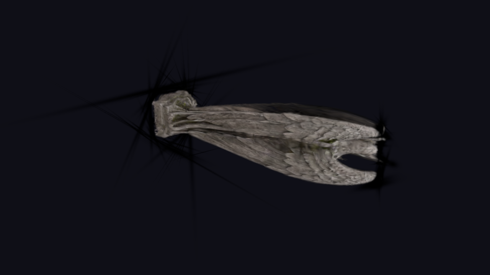
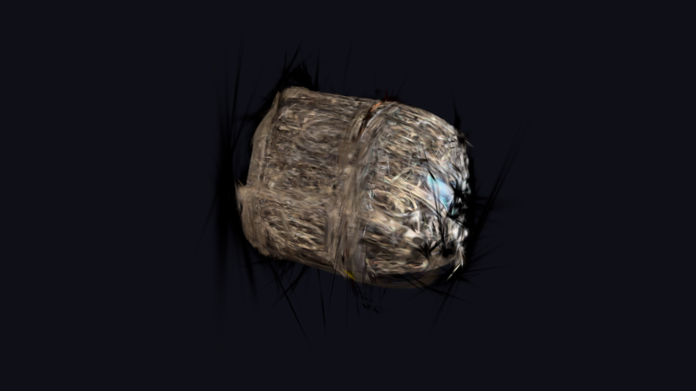
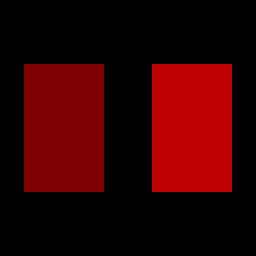
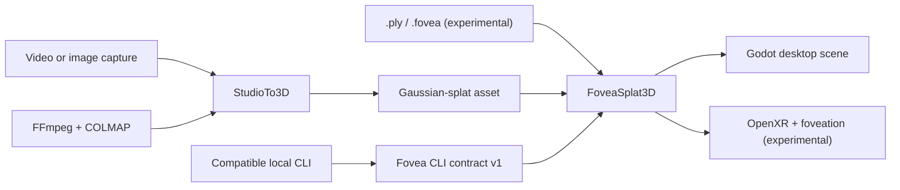

[](https://github.com/zedarvates/FoveaCore)

<div align="center">
  

  <h1>FoveaEngine</h1>

  <p><strong>Render, edit, and reconstruct Gaussian-splat scenes directly in Godot.</strong></p>
  <p>A Godot 4 addon for real-time splat rendering, StudioTo3D reconstruction, and experimental foveated VR workflows.</p>

  <p>
    <a href="https://github.com/zedarvates/FoveaCore/actions/workflows/ci.yml"></a>
    <a href="https://godotengine.org/"></a>
    <a href="LICENSE"></a>
    
  </p>

  <p>
    <a href="#quick-start">Quick start</a> ·
    <a href="docs/feature-status.md">Feature status</a> ·
    <a href="docs/developer_reference.md">Developer reference</a> ·
    <a href="docs/autowiki/README.md">Autowiki</a> ·
    <a href="README_CN.md">简体中文</a>
  </p>
</div>


<p align="center"><sub>StudioTo3D inside Godot: dependency setup, region controls, reconstruction stages, and render options. The interface is under active development.</sub></p>

## Runtime gallery

Real Gaussian-splat captures from the desktop runtime. More viewpoints and credits live in the [runtime gallery](docs/GALLERY.md).


_CC0 horse statue reconstructed with gsplat, then loaded through FoveaSplat3D. Desktop Forward+, not an OpenXR proof._

<p align="center">
  
  
</p>

_Left: framed horse-statue PLY. Right: bonsaitree.mp4 reconstructed photorealistically (34,759 splats) and recaptured in Godot._




_stone gargoyle statue.mp4 reconstructed photorealistically (31,236 splats, PSNR 33.2) and recaptured in Godot._



_steampunk treasure box.mp4 reconstructed photorealistically (65,505 splats) and recaptured in Godot._

---

## Real-camera reference: Furby turntable

FoveaEngine uses a Furby turntable capture as its primary local real-world
Gaussian-splat stress case. Small object turntables are a practical capture
pattern for testing reconstruction pipelines, while this particular subject
adds difficult fur, thin ears, glossy eyes, fine color transitions, and visible
failure modes when the object moves between frames.

```text
real camera video -> 60 views -> COLMAP poses -> gsplat/CUDA
                  -> 18,774 trained splats -> 17,013 runtime splats
                  -> FoveaSplat3D in Godot
```

| Evidence | Recorded result |
| --- | --- |
| Source | Real 854x480 camera video, not an image-generated model |
| Training | 7,000 iterations with gsplat, SH degree 3 |
| Runtime | 17,013 sanitized splats loaded through `FoveaSplat3D` |
| Desktop proof | D3D12 Forward+ on an RTX 5060 Ti, with a settled 58-60 FPS capture |
| Known limitation | Subject motion produced blur and ghosted ears; this is preserved as useful failure evidence |

This is a **FoveaEngine reference stress test**, not a claim that Furby is a
standardized academic benchmark. The source footage, reconstructed asset, and
captures remain local because the validation media is not redistributable. The
demo therefore selects the Furby proof when it exists locally, then falls back
to the checked-in CC0 synthetic-video reconstruction and finally to the parser
fixture. See the [Drop a PLY demo record](demo/README.md) for that selection
boundary.

> [!WARNING]
> FoveaEngine is pre-release software. Core addon and PLY workflows are available with validation; GPU, XR, and research reconstruction paths still require representative target-hardware testing. See the [feature status matrix](docs/feature-status.md) before adopting a subsystem.

## Why FoveaEngine?

- **Godot-native workflow** — add the stable `FoveaSplat3D` node, assign an asset, and keep splats inside your regular scene tree.
- **Capture-to-runtime pipeline** — use StudioTo3D with FFmpeg and COLMAP, or bring an existing `.ply` asset; native `.fovea` now reaches the desktop viewport through a deterministic fallback, while visual fidelity remains experimental.
- **Performance-oriented architecture** — GPU sorting, hierarchical LOD, culling, and foveation are built into decoupled subsystems.
- **Desktop and immersive targets** — develop on a standard Forward+ viewport, then validate experimental OpenXR and eye-tracked rendering on supported hardware.

## Redistributable runtime snapshot

<p align="center">
  
</p>

<p align="center"><sub>The checked-in <code>demo_bonsai.ply</code> fixture loaded through <code>FoveaSplat3D</code> in Godot 4.7.dev5, Forward+, and D3D12 desktop mode. This capture demonstrates the current PLY runtime path; it is not a performance benchmark.</sub></p>

### Fail-closed transparency gate

<p align="center">
  
</p>

<p align="center"><sub>The deterministic D3D12 oracle measured one 50% layer at 0.498 and two layers at 0.749, against 0.500 and 0.750 expectations. Its forced negative control exits non-zero. This validates framebuffer composition, not production Gaussian-splat parity. See the <a href="addons/foveacore/test/README_TRANSPARENCY_TESTS.md">transparency harness record</a>.</sub></p>

## How it fits together



## Quick start

### 1. Open the demo

You need **Godot 4.7.dev5 Mono** (or a compatible later 4.7 build) and a Forward+ capable GPU.

```bash
git clone --recurse-submodules https://github.com/zedarvates/FoveaCore.git
cd FoveaCore
```

Open `project.godot`, then run [`demo/drop_a_ply.tscn`](demo/drop_a_ply.tscn).
The demo prefers the local Furby real-camera proof when available, otherwise it
loads the included CC0 synthetic-video reconstruction; the small parser fixture
is the final fail-closed fallback. An FPS overlay identifies the active source.
FFmpeg, COLMAP, and VR hardware are not required to view an existing splat
asset.

### 2. Add a splat to your scene

Add a `FoveaSplat3D` node in the editor and set `source_path`, or create it from GDScript:

```gdscript
var splat := FoveaSplat3D.new()
splat.source_path = "res://test/demo_bonsai.ply"
add_child(splat)
```

Use `quality_preset`, `opacity`, and `generate_collisions` for the common runtime controls. Advanced styling and animation remain available through `get_advanced()` while the public API stabilizes.

### 3. Reconstruct from video

Install and configure FFmpeg and COLMAP, then follow the [reconstruction setup](tutorials/reconstruction_setup.md). Optional research bridges have separate dependencies and maturity levels.

### 4. Automate a splat safely

FoveaCore includes a provider-neutral automation bridge for compatible local
Godot control tools. The bridge reports current splats, validates their assets,
and can add an unsaved `FoveaSplat3D` from an existing `res://` file. It does
not start a listener, write scene files, or invoke Gemini or another model.

With the compatible Ultimate Odycer runtime CLI installed and explicitly
started in mutation mode:

```bash
uo-godot-cli fovea status
uo-godot-cli fovea add /root/Main res://test/demo_bonsai.ply --quality balanced
uo-godot-cli fovea validate
```

The CLI remains responsible for loopback authentication and mutation approval.
FoveaCore remains responsible for path, format, load-result, and scene checks.
Saving is a separate unsafe operation and never happens automatically.

## Feature readiness

| Area | Status | What it means |
| --- | --- | --- |
| Godot addon and `FoveaSplat3D` | Available with validation | The public-node/delegate lifecycle and controls pass 26/26 headless assertions; representative rendering still requires the supplied target-renderer gates. |
| PLY runtime workflow | Available with validation | The checked-in fixture loads and renders; validate your own asset and target GPU. |
| Local CLI automation contract | Available with validation | Contract v1 can inspect, add, and validate an unsaved splat; it starts no listener and writes no files. |
| Native `.fovea` v2 structure | Available with validation | Godot 4.7.dev5 passes 28 structural and corrupt-input assertions; the deterministic Rust fixture is byte-reproducible. |
| Native `.fovea` runtime workflow | Experimental | Godot 4.7.dev5/D3D12 loaded the 12,473-record bonsai, retained 11,808 splats after cleaning, and produced a framed green/brown 800×600 capture through the default CPU passthrough. Palette lookup, asset bounds, and linear covariance scale now match the v2 sections; a synthetic two-instance GPU layout/readback passes, while representative native image parity and acceleration remain open. |
| Experimental C++ GDExtension | Experimental | The Windows release target now owns `foveacore_cpp.dll` and `foveacore_cpp_init`, leaving the packaged Rust runtime untouched. A local Windows build, Godot registration/instantiation smoke, and missing-binary negative control pass. The CI workflow now builds and smoke-tests that artifact; remote certification, portability, and renderer parity remain open. |
| FFmpeg + COLMAP StudioTo3D | Available with validation | Requires working local installations and suitable source footage. |
| GPU sorting and voxel HLOD | Experimental | D3D12 Forward+ returned a complete back-to-front GPU permutation for the 17,013-splat video reconstruction; the focused sorter gate passed 30/30 and the static-cache gate passed 7/7. The settled demo capture reports 60 FPS on the recorded RTX 5060 Ti, while other GPUs, native `.fovea` compute culling, XR, and portability remain open. |
| Tile-based compute rasterizer | Experimental | The 16×16 path passes a 10/10 D3D12 dispatch/readback gate on an RTX 5060 Ti; standard-renderer equivalence and measured performance remain open. |
| Transparency framebuffer harness | Experimental | A deterministic alpha oracle passes on the recorded D3D12 system and fails closed under its negative control; the five 3D layouts are not yet compared with production splat output. |
| OpenXR, eye tracking, and foveation | Experimental | Requires a supported runtime, headset, and representative smoke tests. |
| Multiplayer VR synchronization | Experimental | A loopback two-process ENet test covers join, pose, authority-mediated brush replication, and disconnect cleanup; two-headset OpenXR validation is still required. |
| ComfyUI image-to-splat bridge | Experimental | API workflows can upload an image and import generated `.fovea`, `.ply`, or `.splat` output into `FoveaSplat3D`; the loopback contract is tested, while a real 3DGS/Blender workflow remains a release gate. |
| WorldMirror 2.0 bridge | Experimental | Optional local installation; production inference is not bundled. |
| DVLT and AnyRecon bridges | Dry-run only | Integration scaffolding exists, but inference is not wired. |
| Vista4D and 4D capture | Unavailable | Non-dry-run paths fail explicitly instead of fabricating output. |

The full, release-facing matrix lives in [`docs/feature-status.md`](docs/feature-status.md).

## Documentation

- **Runtime gallery** — [Captured desktop splat results](docs/GALLERY.md).

- [Explore the FoveaCore Godot addon](addons/foveacore/README.md)
- [Load your first Gaussian splat](tutorials/get_started.md)
- [Configure reconstruction dependencies](tutorials/reconstruction_setup.md)
- [Explore 3DGS training and editing](tutorials/3dgs_training.md)
- [Understand the subsystem architecture](docs/developer_reference.md)
- [Review the experimental C++ GDExtension build contract](addons/foveacore/gdextension/README_BUILD.md)
- [Browse the evidence-based Autowiki](docs/autowiki/README.md)
- [Review dependencies and local configuration](DEPENDENCIES.md)
- [Inspect the benchmark harness and targets](docs/benchmark.md)
- [Connect a ComfyUI image-to-splat workflow](docs/comfyui-splat-bridge.md)

## Development checks

Run the checks relevant to the component you change:

```bash
dotnet build FoveaEngine.csproj --configuration Release --nologo
dotnet test tests/FoveaEngine.Tests/FoveaEngine.Tests.csproj --configuration Release --nologo
cargo test --manifest-path addons/foveacore/rust/Cargo.toml
python addons/tools/test_validation_tools.py
python tools/check_public_docs.py
godot --headless --xr-mode off --path . -s res://addons/foveacore/test/test_fovea_cli_bridge.gd
```

Optional agent integrations are intentionally local-only. Copy the tracked
`.mcp.json.example`, `.claude/settings.json.example`, and
`.botte/config.json.example` files to their unsuffixed names when needed, then
run `python tools/botte_entrypoint.py check`. The entry point uses the pinned
`botte-secrete` submodule or `BOTTE_SOURCE_ROOT`; generated reports and agent
conversation histories are excluded from version control.

Run the project-policy audit portably with
`python tools/botte_entrypoint.py checkup`.

GPU, OpenXR, reconstruction, and visual checks must also run on representative hardware; headless success alone is not runtime certification.
