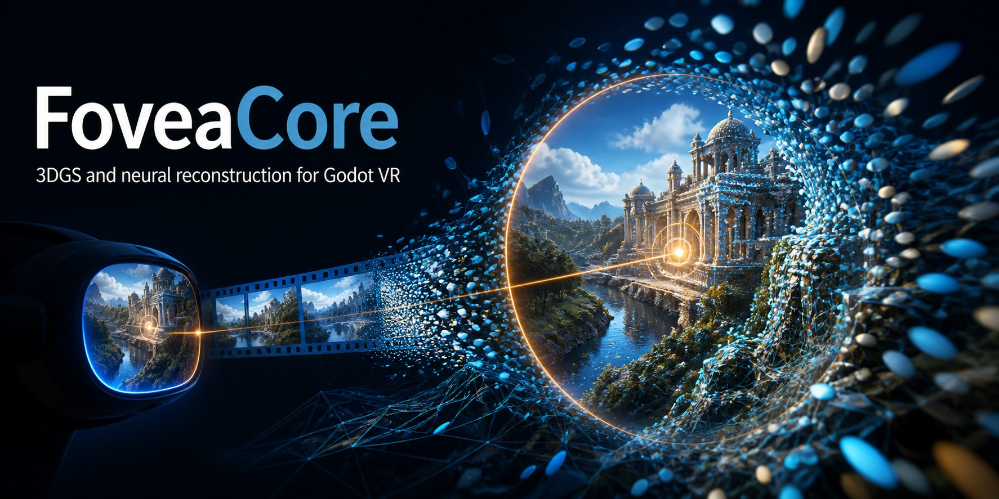
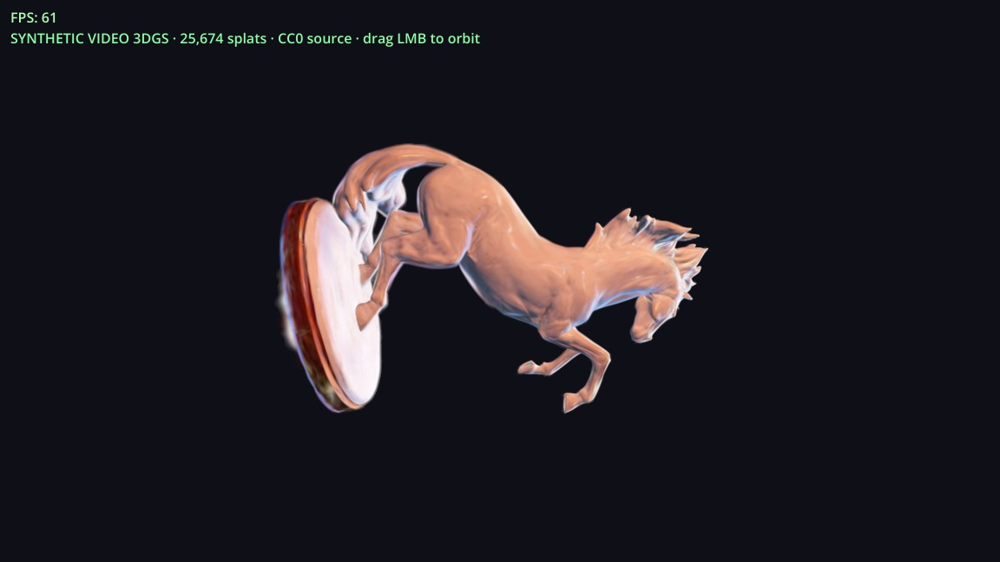
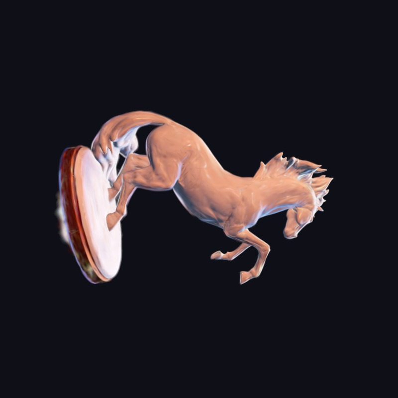
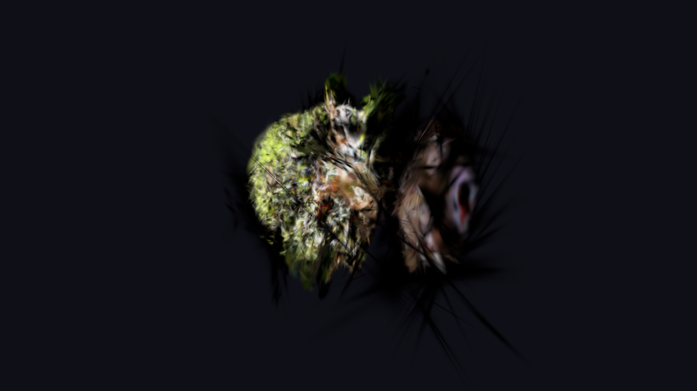
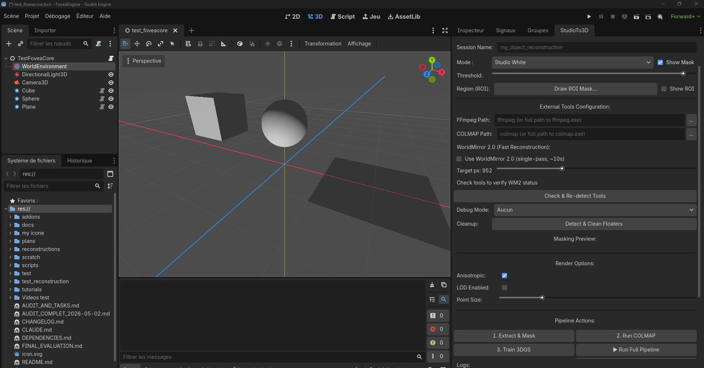

[](https://github.com/zedarvates/FoveaCore)

> **"Bienvenue dans la matrice! Tsukuyomi Infini (Infinite Tsukuyomi)" C'est tout ce que vous méritez**

# FoveaCore 🔷 — Advanced 3DGS & Neural Reconstruction Engine

[]()
[]()
[]()
[]()

**Next-generation hybrid rendering engine for Godot 4** — combining structural low-poly meshes with real-time 3D Gaussian Splatting (3DGS), feed-forward neural reconstruction, and a procedural style engine. Designed for expressive, high-performance VR on accessible hardware.

---

> [!TIP]
> **🚀 WorldMirror 2.0 — 3DGS Reconstruction in ~10 seconds**
> The pipeline uses Tencent Hunyuan WorldMirror 2.0 as the main backend: feed-forward video → 3DGS + depth + cameras in a single forward pass.
> - **WorldMirror Mode**: ~2-10s (recommended, requires CUDA 12.4 + 8GB+ VRAM)
> - **COLMAP + 3DGS Mode** (fallback): 30-90 min
> See [DEPENDENCIES.md](./DEPENDENCIES.md) for setup.

> [!IMPORTANT]
> **Dependencies**: FFmpeg (required) + COLMAP (fallback) + WorldMirror 2.0 (recommended).
> Check **[DEPENDENCIES.md](./DEPENDENCIES.md)** and run `scripts/setup_worldmirror.sh` for installation.

---

## Preview

Real Gaussian-splat captures from the desktop runtime. More viewpoints and credits live in the [runtime gallery](docs/GALLERY.md).



_CC0 horse statue reconstructed with gsplat, then loaded through FoveaSplat3D. Desktop Forward+, not an OpenXR proof._

<p align="center">
  
  
</p>

_Left: framed horse-statue PLY. Right: bonsaitree.mp4 reconstructed photorealistically (34,759 splats) and recaptured in Godot._



_StudioTo3D inside the Godot editor. Interface still evolving._

---

## Core Innovation Areas

### 🔷 Hybrid Mesh + 3DGS Rendering
- **Structural low-poly geometry** with dynamic LOD
- **Real-time Gaussian Splatting** — PLY, `.fovea` binary (Rust fast-path), GPU compute pipeline
- **Foveated rendering** for VR — OpenXR eye tracking, neural foveation, layered LOD
- **GPU compute culling** — backface culling (compute shader) + Hi-Z occlusion culling
- **Anisotropic splats** — true ellipses via covariance codebook texture + Gaussian exp() alpha

### 🔷 StudioTo3D — Video → 3DGS Pipeline
A complete pipeline to turn video footage into Gaussian Splat assets:
1. **Smart masking** — white/chroma/luma background removal + ROI lasso tool
2. **WorldMirror 2.0 & DVLT** — feed-forward video→3DGS (~10s) or multi-view unposed reconstruction with refinement loops via DiffSynth bridge
3. **COLMAP fallback** — SfM + 3DGS training (30-90 min)
4. **GPU cleaning** — NaN/Inf removal, floater filtering via spatial hash grid, decimation
5. **SplatBrush** — VR sculpting, deformation, and flow current painting in real time

### 🔷 Advanced GPU Pipeline
- **GPU bitonic sort** — depth sorting fully on compute shader (0 CPU overhead)
- **Temporal & interleaved sorting** — distributed over N frames to eliminate CPU-GPU stalls
- **FP16 depth keys** — pre-computed depth keys before sorting (~4-6× bandwidth reduction)
- **Motion-Adaptive LOD** — kinematic LOD: stretch splats and reduce density during fast camera movement
- **Vectorized splat dispatcher** — all assets in a single GPU dispatch with subgroup ballot (32× less contention)
- **Global Splat Instancing** — render thousands of instances of a `.fovea` asset with a single VRAM allocation and GPU-driven frustum culling (`FoveaInstancedCuller`)
- **Spatial chunking & streaming** — Morton-code block culling + file RAM caching
- **Coplanar splat merging** — ~20-40% overdraw reduction via centroid fusion

### 🔷 Vector Quantization & Compression
- **8-bit color palette** (256 colors) with Floyd-Steinberg dithering
- **1024-cluster covariance codebook** via K-Means++
- **Spatial quantization** — XYZ → 16-bit local grid (AABB-mapped)
- **`.fovea` binary format** — native container for GPU direct-memory upload (Rust)

### 🔷 Artistic Style Engine
- **6 procedural materials** — stone, wood, metal, skin, fabric, glass
- **FBM/Worley noise** generation via GPU compute
- **Artistic shaders** — Oil Painting (posterized + brush edges), Watercolor (soft falloff + granulation), Crosshatch (dual-oriented hatching)
- **GPU Water Splat Particles** — real-time physics simulation of volatile water splats (advection, obstacle collision, bounce physics, and recycling) running entirely in vertex shaders, with paintable flow currents
- **Neural style bridge** — ComfyUI integration for AI-assisted texturing

### 🔷 VR & Interaction
- **OpenXR** initialization and lifecycle management
- **Foveated rendering** — layered LOD controller, gaze tracking
- **Proxy face rendering** — parallax depth simulation for billboard faces
- **Splat interaction** — `FoveaClayDeformer` allows dynamic splat sculpting and deformation in real time (deform_multimesh).
- **SplatBrushEngine** — supports `FLOW` brush mode to paint localized water flow currents onto splats
- **Fast-Path Rust** GDExtension for splat baking

---

## Architecture

```
FoveaCore (Godot 4 Addon)
├── addons/foveacore/
│   ├── scenes/                    # Prefabs (VR Rig, Playground, Workspace)
│   │   ├── fovea_vr_rig.tscn
│   │   ├── studio_workspace.tscn
│   │   └── splat_brush_playground.tscn
│   ├── scripts/
│   │   ├── foveacore_manager.gd      # High-level orchestrator
│   │   ├── fovea_vr_subsystem.gd     # OpenXR lifecycle
│   │   ├── fovea_foveated_subsystem.gd  # Foveated rendering
│   │   ├── fovea_splat_subsystem.gd  # Splat orchestration
│   │   └── ... (40+ scripts)
│   ├── scripts/reconstruction/       # StudioTo3D backend
│   │   ├── reconstruction_manager.gd
│   │   ├── diffsynth_bridge.py       # Unified Python backend
│   │   ├── worldmirror_bridge.py     # WorldMirror Python backend
│   │   └── studio_to_3d_panel.gd    # UI panel
│   ├── scripts/advanced/             # High-performance rendering
│   │   ├── fovea_core_splat_renderer.gd # GPU splat rendering
│   │   ├── fovea_splat_dispatcher.gd    # Vectorized splat dispatcher
│   │   ├── fovea_splat_cleaner.gd       # NaN/Inf/floater & coplanar cleaning
│   │   ├── fovea_instanced_splat_renderer.gd # Global splat instancing
│   │   ├── fovea_instanced_culler.gd         # GPU instanced culler
│   │   ├── neural_style_bridge.gd
│   │   └── game_ready_optimizer.gd
│   ├── shaders/                      # GLSL + Godot shaders
│   │   ├── splat_render.gdshader
│   │   ├── splat_render_artistic.gdshader  # Oil/Watercolor/Crosshatch
│   │   ├── water_splat_particle.gdshader   # Volatile water splats
│   │   ├── gpu_culling_compute.glsl
│   │   ├── gpu_culling_instanced.glsl      # GPU instanced culler
│   │   ├── sort_bitonic_keyed.glsl   # GPU bitonic sort
│   │   ├── depth_precompute.glsl     # FP16 depth keys
│   │   └── ... (20+ shaders)
│   ├── gdextension/                  # C++ GDExtension
│   │   └── src/fovea_renderer.cpp
│   ├── rust/                         # Rust fast-path
│   │   └── splat_sorter/
│   │       └── src/lib.rs
│   └── test/                         # Benchmarks + unit tests
├── plans/                            # Architecture docs, roadmaps
├── scripts/                          # Setup scripts
│   ├── setup_worldmirror.sh
│   └── setup_diffsynth.sh
└── tutorials/
    ├── get_started.md
    ├── reconstruction_setup.md       # Backend setup guide (WorldMirror/DVLT/COLMAP)
    └── 3dgs_training.md              # 3DGS training, baking & SplatBrush guide
```
## 📚 Documentation Index

- **Runtime gallery**: [GALLERY.md](docs/GALLERY.md)
- **Setup & Installation**: [reconstruction_setup.md](tutorials/reconstruction_setup.md)
- **First Steps**: [get_started.md](tutorials/get_started.md)
- **3DGS Optimization & Editing**: [3dgs_training.md](tutorials/3dgs_training.md)
- **API Reference**: [developer_reference.md](docs/developer_reference.md)
- **File Format Specifications**: [ply_format_spec.md](plans/ply_format_spec.md)
- **System Architecture**: [foveacore-architecture.md](plans/foveacore-architecture.md)
- **Contributing Guidelines**: [CONTRIBUTING.md](CONTRIBUTING.md)
```

---

## Quick Start

**Requirements:** Godot 4.6+, FFmpeg. For reconstruction: CUDA 12.4 + 8GB+ VRAM GPU.

```bash
# Clone
git clone https://github.com/zedarvates/FoveaCore.git

# Enable the addon in Godot 4:
#   Project Settings → Plugins → FoveaCore → Enable

# For reconstruction (WorldMirror 2.0 — recommended):
bash scripts/setup_worldmirror.sh

# For reconstruction (DiffSynth — alternative):
bash scripts/setup_diffsynth.sh

# Open a test scene:
#   test/test_foveacore.tscn          — Basic splat rendering
#   addons/foveacore/scenes/studio_workspace.tscn — StudioTo3D pipeline
#   addons/foveacore/scenes/splat_brush_playground.tscn — VR sculpting
```

### Basic Usage (GDScript)

```gdscript
# Add a FoveaSplattable node
var splattable = FoveaSplattable.new()
splattable.splat_file_path = "res://path/to/model.ply"
add_child(splattable)

# The splat loads automatically. Toggle rendering options:
splattable.splatting_enabled = true
splattable.hide_mesh_when_splatting = true  # Hide original placeholder mesh
```

### StudioTo3D Auto-Integration
When a reconstruction session finishes successfully, the editor panel **automatically instantiates and adds a `FoveaSplattable` node** under the root of your currently open active edited 3D scene (with the name `Splat_<session_name>`).
* This node is correctly linked to the generated `.ply` file.
* It sets the node owner so it is persistently saved inside your `.tscn` scene file.
* If a node with that name already exists, it updates the file path to the newly generated result.
* **Robust Error Handling**: The pipeline automatically verifies reconstruction outputs (`database.db` and `sparse/0` files) after the SfM stage. If COLMAP fails (e.g., due to insufficient frame overlap/features), the manager gracefully halts the pipeline, sets the session status to `"Erreur"`, and displays the specific failure reason.

---

## Feature Status

| Area | Status | Details |
|------|--------|---------|
| **Core 3DGS Rendering** | ✅ Production | PLY loading, GPU bitonic sort, MultiMeshInstance3D |
| **GPU Compute Culling** | ✅ Production | Backface + Hi-Z occlusion culling |
| **Fast-Path Rust** | ✅ Production | Binary `.fovea` loading (16B/splat, VQ 1024 codebook) |
| **WorldMirror 2.0 & DVLT** | ✅ Production | Feed-forward video→3DGS (~10s) or multi-view unposed reconstruction (DVLT) |
| **StudioTo3D Pipeline** | ✅ Production | FFmpeg + WM2/DVLT/COLMAP reconstruction UI |
| **GPU Background Masking** | ✅ Production | White/Chroma/Smart compute shader |
| **Style Engine** | ✅ Production | 6 materials + FBM/Worley noise |
| **Artistic Shaders** | ✅ Production | Oil painting, watercolor, crosshatch |
| **GPU Water Splats** | ✅ Production | Flow advection, obstacle collision/splash, and recycling simulation on GPU |
| **Motion-Adaptive LOD** | ✅ Production | Kinematic LOD with decay |
| **SplatBrush (VR)** | ✅ Production | Interactive splat deformation and flow direction painting |
| **Vectorized Splat Dispatch** | ✅ Production | Single GPU dispatch, subgroup ballot |
| **Global Splat Instancing** | ✅ Production | Single VRAM asset instancing, GPU culling (`FoveaInstancedCuller`) |
| **Coplanar Splat Merging** | ✅ Production | ~20-40% overdraw reduction |
| **Spatial Chunking & Streaming** | ✅ Production | Morton-code + RAM caching |
| **VQ Compression** | ✅ Production | 8-bit color + 1024-cluster codebook |
| **Splat Cleaning** | ✅ Production | NaN/Inf/floater removal in GPU pipeline |
| **Anisotropic Splats** | ✅ Production | True ellipses via covariance |
| **Layered Splatting** | ✅ Production | Multi-layer support (BASE/SATURATION/LIGHT/SHADOW) fully wired and tested |
| **Dynamic Lighting** | ✅ Production | SplatLightingAnimator automatically connected to Godot light sources |
| **Hybrid Renderer** | ✅ Production | Mesh + Splat rendering fully integrated into manager culling pass |
| **ComfyUI Bridge** | 🗺️ Planned | AI generation directly from Godot (see ComfyUI + Blender workflows, e.g. [Apple Sharp 3DGS](https://youtu.be/gudf_0LAo4Q) & [Single Image 3DGS](https://youtu.be/M3TgA7OIv6Q)) |
| **MIP-Splatting / HLOD** | 🗺️ Planned | Dynamic LOD system |
| **Tile-Based Rasterization** | 🗺️ Planned | Screen tiles for local sorting/blending |
| **Multiplayer VR Sync** | 🗺️ Planned | Shared scene across network |

---

## Development Phases

✅ **Phase 1 — Core Rendering** → Mesh/splat rendering, GPU pipeline  
✅ **Phase 2 — GPU Compute** → Bitonic sort, occlusion culling, Rust fast-path  
✅ **Phase 3 — Visual Fidelity** → Anisotropic splats, VQ, artistic shaders, LOD  
✅ **Phase 4 — StudioTo3D** → WorldMirror 2.0, UI, masking, drag-and-drop integration  
✅ **Phase 5 — VR & Eye Tracking** → OpenXR, foveation, eye-culling, interactive sculpting  
✅ **Phase 6 — AI & Cloud** → ComfyUI bridge, Auto-ROI by AI (SAM/rembg), local ONNX inference

---

## 🤝 Acknowledgments

This project deeply benefits from open-source work that unlocked critical pipeline problems:

###  Tencent Hunyuan — HY-World-2.0

The **[Tencent Hunyuan](https://github.com/Tencent-Hunyuan/HY-World-2.0)** team developed **WorldMirror 2.0**, a revolutionary feed-forward model replacing the entire COLMAP + 3DGS pipeline with a single neural inference. Their open-source work was the keystone enabling us to move from a simulated pipeline (placeholder DA3) to real reconstruction in ~10 seconds. Their diffusers-like approach, exemplary documentation, and permissive license made this integration possible.

- **Repo**: https://github.com/Tencent-Hunyuan/HY-World-2.0
- **Paper**: https://arxiv.org/abs/2604.14268
- **Model**: https://huggingface.co/tencent/HY-World-2.0

### NVIDIA T-Labs — DVLT (Déjà View)

The **[NVIDIA T-Labs](https://github.com/nv-tlabs/dvlt)** team created **DVLT (Déjà View)**, a Looping Transformer for unposed multi-view 3D/4D reconstruction. Their design features a configurable refinement loop (K-steps) that allows a flexible compute-to-quality trade-off, which we integrate as our fourth backend option.

- **Repo**: https://github.com/nv-tlabs/dvlt
- **Paper**: https://arxiv.org/abs/2603.15579

### 3D Gaussian Splatting (Inria / Université Côte d'Azur)

The reference **[3DGS](https://github.com/graphdeco-inria/gaussian-splatting)** implementation defines the standard we follow for rendering and PLY format.

### COLMAP

The **[COLMAP](https://github.com/colmap/colmap)** Structure-from-Motion pipeline remains our reliable fallback for users without WorldMirror 2.0 compatible GPUs.

### Godot Engine

The **[Godot Foundation](https://godotengine.org/)** for their open-source engine enabling real-time VR rendering with compute shaders and GDExtension.

### Eyeline Labs / Netflix — Vista4D (CVPR 2026 Highlight)

**[Vista4D](https://github.com/Eyeline-Labs/Vista4D)** introduces *video reshooting* via 4D point clouds and video diffusion — a complementary approach to WorldMirror for novel viewpoint synthesis and 4D scene editing. Their work on point cloud editing (duplicate/remove/insert) and dynamic scene expansion directly inspires FoveaEngine's future VR editing capabilities.

### Shanghai AI Lab / CUHK — AnyRecon

**[AnyRecon](https://github.com/OpenImagingLab/AnyRecon)** proposes 3D reconstruction from sparse arbitrary views with a global memory cache and 4-step distillation — paving the way for long trajectory reconstructions (>200 frames) and fast inference for FoveaEngine.

### DiffSynth-Studio Ecosystem

All four projects (HY-World-2.0, Vista4D, AnyRecon, DVLT) share **[DiffSynth-Studio](https://github.com/modelscope/DiffSynth-Studio)** and **[Wan 2.1](https://github.com/Wan-Video/Wan2.1)** as their common foundation. FoveaEngine now integrates a [unified DiffSynth bridge](addons/foveacore/scripts/reconstruction/diffsynth_bridge.py) enabling runtime backend selection. See the [Comparative analysis](./plans/analyse_vista4d_anyrecon.md).

###  Manycore Tech — Aholo Viewer

An open-source WebGL-based viewer for rendering massive, city-scale environments with over 1 billion Gaussian splats. Its streamable Level-of-Detail (LoD) architecture, chunk-level streaming, and camera physics/collision system serve as a prime reference for FoveaEngine's upcoming HLOD, tile-based rasterization, and interactive physics pipelines.

- **Repo**: [manycoretech/aholo-viewer](https://github.com/manycoretech/aholo-viewer)
- **Demo Video**: [A Billion 3D Splats Rendering in Your Browser](https://youtu.be/2t-PLeenqqA)

---

## Related Projects


---

## 🤝 Support

If you find this project useful, consider supporting its development:

Your support helps keep the servers running ☕

---

## License

MIT


---

