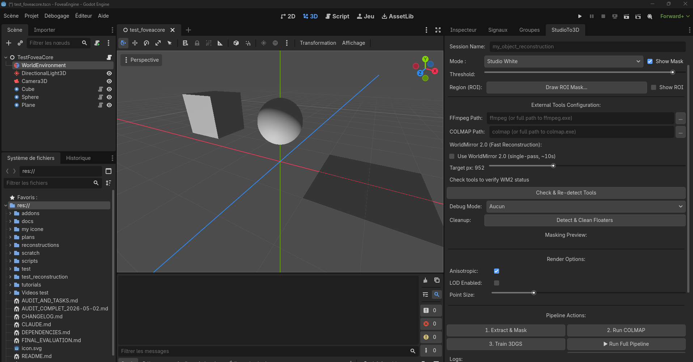
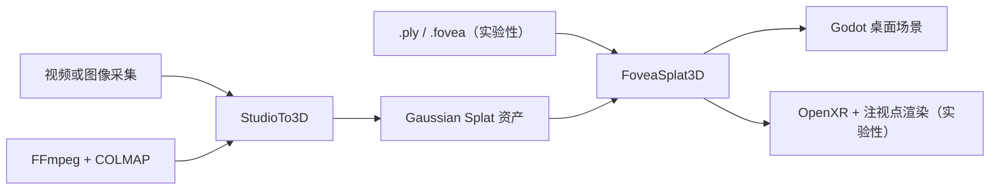

<div align="center">
  

  <h1>FoveaEngine</h1>

  <p><strong>直接在 Godot 中渲染、编辑和重建 3D Gaussian Splatting 场景。</strong></p>
  <p>面向实时高斯泼溅渲染、StudioTo3D 重建和实验性注视点 VR 的 Godot 4 插件。</p>

  <p>
    <a href="https://github.com/zedarvates/FoveaCore/actions/workflows/ci.yml"></a>
    <a href="https://godotengine.org/"></a>
    <a href="LICENSE"></a>
    
  </p>

  <p>
    <a href="README.md">English</a> ·
    <a href="#快速开始">快速开始</a> ·
    <a href="docs/feature-status.md">功能状态</a> ·
    <a href="docs/developer_reference.md">开发者参考</a>
  </p>
</div>



<p align="center"><sub>Godot 内的 StudioTo3D：依赖配置、区域控制、重建阶段和渲染选项。界面仍在持续开发。</sub></p>

> [!WARNING]
> FoveaEngine 仍是预发布软件。核心插件和 PLY 工作流已有本地验证；GPU、XR 和研究型重建路径仍需在目标硬件上进行代表性测试。采用子系统前请先查看[功能状态矩阵](docs/feature-status.md)。

## 为什么选择 FoveaEngine？

- **Godot 原生工作流** — 添加稳定的 `FoveaSplat3D` 节点、指定资产，并让高斯泼溅留在常规场景树中。
- **从采集到运行时** — 使用 FFmpeg 与 COLMAP 驱动 StudioTo3D，或直接加载已有的 `.ply` 资产；原生 `.fovea` 已可通过确定性回退进入桌面视口，但视觉保真度仍处于实验阶段。
- **面向性能的架构** — GPU 排序、分层 LOD、裁剪和注视点渲染由解耦子系统负责。
- **桌面与沉浸式目标** — 先在标准 Forward+ 视口中开发，再在受支持硬件上验证实验性 OpenXR 和眼动追踪。

## 运行时截图

<p align="center">
  
</p>

<p align="center"><sub>仓库内的 <code>demo_bonsai.ply</code> 通过 <code>FoveaSplat3D</code> 加载，并在 Godot 4.7.dev5、Forward+、D3D12 桌面模式中完成真实捕获。此截图用于证明当前 PLY 运行时路径，不是性能基准。</sub></p>

## 工作流程



## 快速开始

### 1. 运行演示

需要 **Godot 4.7.dev5 Mono**（或兼容的后续 4.7 版本）以及支持 Forward+ 的 GPU。

```bash
git clone --recurse-submodules https://github.com/zedarvates/FoveaCore.git
cd FoveaCore
```

打开 `project.godot`，然后运行 [`demo/drop_a_ply.tscn`](demo/drop_a_ply.tscn)。该演示会加载仓库内的参考资产并显示 FPS；查看已有高斯泼溅资产不需要 FFmpeg、COLMAP 或 VR 硬件。

### 2. 在场景中添加高斯泼溅

在编辑器中添加 `FoveaSplat3D` 节点并设置 `source_path`，或使用 GDScript：

```gdscript
var splat := FoveaSplat3D.new()
splat.source_path = "res://assets/garden.ply"
add_child(splat)
```

常用运行时选项包括 `quality_preset`、`opacity` 和 `generate_collisions`。高级样式与动画功能可通过 `get_advanced()` 访问，其公共 API 仍在稳定中。

### 3. 从视频重建

安装并配置 FFmpeg 与 COLMAP，然后按照[重建配置指南](tutorials/reconstruction_setup.md)操作。可选研究桥接器拥有独立的依赖和成熟度等级。

## 功能成熟度

| 模块 | 状态 | 含义 |
| --- | --- | --- |
| Godot 插件与 `FoveaSplat3D` | 可用但需验证 | 请在目标渲染器和真实资产上运行随附场景。 |
| PLY 运行时工作流 | 可用但需验证 | 仓库测试资产已成功加载和渲染；仍需验证你的资产与目标 GPU。 |
| 原生 `.fovea` v2 结构 | 可用但需验证 | Godot 4.7.dev5 已通过 28 项结构和损坏输入断言；确定性 Rust 测试资产可逐字节重现。 |
| 原生 `.fovea` 运行时工作流 | 实验性 | Godot 4.7.dev5/D3D12 通过默认 CPU passthrough 读取 12,473 条记录，清理后保留 11,808 个 splat，并写出 800×600 截图；两个实例的合成 GPU 布局与回读测试已通过，但代表性原生图像一致性和加速验证仍未完成。 |
| FFmpeg + COLMAP StudioTo3D | 可用但需验证 | 需要正常工作的本地安装和适合的源素材。 |
| GPU 排序与体素 HLOD | 实验性 | 准备发布的索引会拒绝不完整的 GPU 排列，并回退到精确的 12,473 splat CPU 排序；GPU 排序正确性、过渡效果与图像质量仍需跨资产和设备验证。 |
| 分块计算光栅器 | 实验性 | 16×16 路径在 RTX 5060 Ti 上通过 10/10 D3D12 调度与回读检查；仍需与标准渲染器比较并测量真实性能。 |
| OpenXR、眼动追踪与注视点渲染 | 实验性 | 需要受支持的运行时、头显和代表性冒烟测试。 |
| 多人 VR 同步 | 实验性 | 本机双进程 ENet 测试已覆盖加入、姿态、经权限控制的笔刷复制和断线清理；仍需双头显 OpenXR 硬件验证。 |
| ComfyUI 图像转泼溅桥接器 | 实验性 | API 工作流可以上传图像，并把生成的 `.fovea`、`.ply` 或 `.splat` 产物导入 `FoveaSplat3D`；本机回环协议已有测试，真实 3DGS/Blender 工作流仍是发布门槛。 |
| WorldMirror 2.0 桥接器 | 实验性 | 需要可选的本地安装；仓库不捆绑生产推理环境。 |
| DVLT 与 AnyRecon 桥接器 | 仅 dry-run | 已有集成脚手架，但尚未连接真实推理。 |
| Vista4D 与 4D 采集 | 不可用 | 非 dry-run 路径会明确失败，不会伪造输出。 |

完整的发布状态请查看 [`docs/feature-status.md`](docs/feature-status.md)。

## 文档

- [加载第一个 Gaussian Splat](tutorials/get_started.md)
- [配置重建依赖](tutorials/reconstruction_setup.md)
- [了解 3DGS 训练与编辑](tutorials/3dgs_training.md)
- [阅读子系统架构](docs/developer_reference.md)
- [查看实验性 C++ GDExtension 构建契约](addons/foveacore/gdextension/README_BUILD.md)
- [浏览基于证据的 Autowiki](docs/autowiki/README.md)
- [检查依赖和本地配置](DEPENDENCIES.md)
- [查看基准测试工具与目标](docs/benchmark.md)
- [连接 ComfyUI 图像转泼溅工作流](docs/comfyui-splat-bridge.md)

## 开发验证

请运行与改动模块相关的检查：

```bash
dotnet build FoveaEngine.csproj --configuration Release --nologo
cargo test --manifest-path addons/foveacore/rust/Cargo.toml
python addons/tools/test_validation_tools.py
python tools/check_public_docs.py
```

可选的代理集成仅保存在本机。需要时，可将仓库中的
`.mcp.json.example`、`.claude/settings.json.example` 和
`.botte/config.json.example` 复制为不带 `.example` 的文件，然后运行
`python tools/botte_entrypoint.py check`。该入口会使用固定版本的
`botte-secrete` 子模块或 `BOTTE_SOURCE_ROOT`；生成报告和代理对话历史不会进入版本控制。

可通过 `python tools/botte_entrypoint.py checkup` 运行项目策略检查。

GPU、OpenXR、重建和视觉检查还必须在代表性硬件上运行；无头模式成功并不等同于运行时认证。
