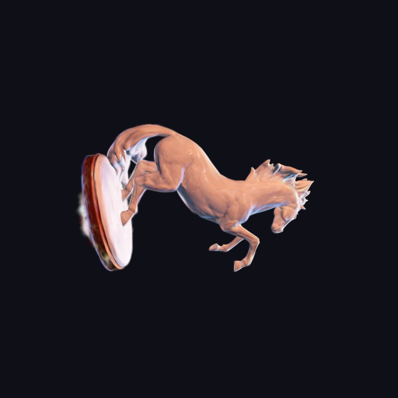
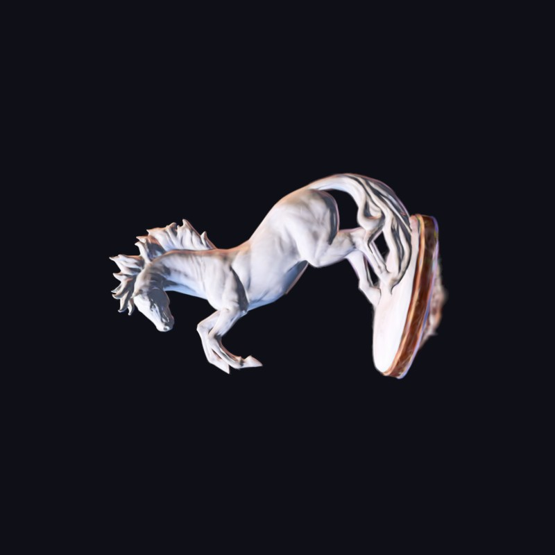
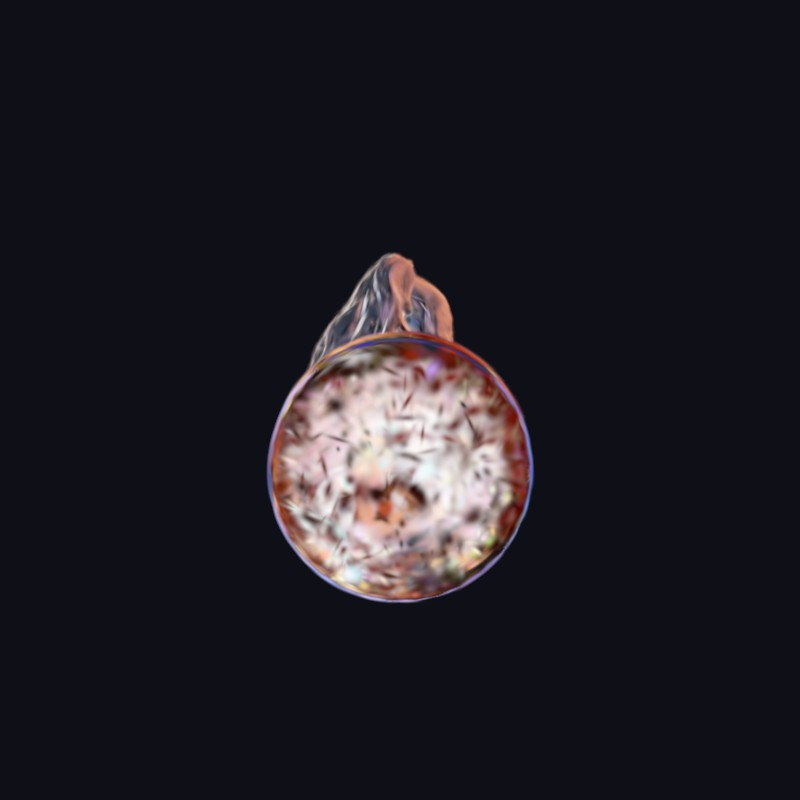
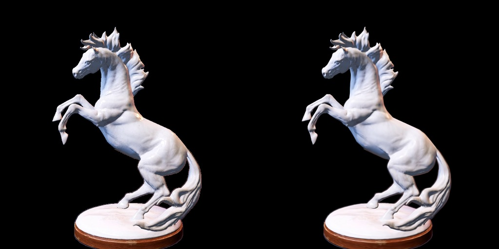
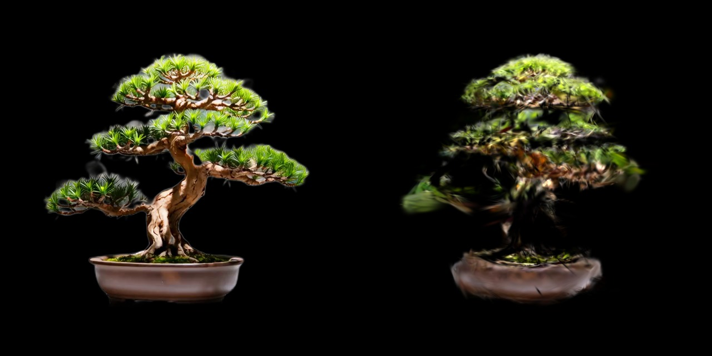

# FoveaCore runtime gallery

Real Gaussian-splat captures from the local FoveaCore desktop runtime. These are reconstructed splat renders, not concept art.

This page does **not** claim OpenXR / VR proof, city-scale streaming, or production visual parity with every backend. Desktop Forward+ captures only.

## Horse statue - video to 3DGS to Godot

Synthetic turntable video of [Horse Statue 01](https://polyhaven.com/a/horse_statue_01) (Rico Cilliers, [Poly Haven](https://polyhaven.com), CC0) reconstructed with official gsplat (25,674 splats after sanitize) and loaded through FoveaSplat3D in Godot 4.7.dev5, Forward+, D3D12.

_Default demo capture at 61 FPS. Overlay text is from the local proof scene, not a benchmark claim._

<table>
<tr>
<td></td>
<td></td>
</tr>
<tr>
<td></td>
<td></td>
</tr>
</table>

_Four framed runtime viewpoints of the same PLY in the Godot viewport._

_Official gsplat validation pair at step 6999 (PSNR 34.62, SSIM 0.986). Left: source view. Right: reconstructed splat._

## Bonsai fixture

_Photorealistic reconstruction of Videos test/bonsaitree.mp4: 41 masked turntable views, official gsplat 7000 steps, 34,759 splats, then FoveaSplat3D desktop capture. Not OpenXR._

_Fresh desktop recapture of demo_bonsai.ply through FoveaSplat3D: 12,473 splats, Godot 4.7.dev5, D3D12 Forward+. Not an OpenXR proof and not a benchmark._

_Official gsplat validation pair at step 6999 (PSNR 18.61, SSIM 0.783). Left: source view. Right: reconstructed splat._

## StudioTo3D editor

_In-editor reconstruction dock: dependency setup, region controls, stages, and render options. Interface still evolving._

## What is not shown

- No Furby or other rights-restricted captures.
- No OpenXR / eye-tracked captures.
- No claim that WorldMirror 2.0 produced these particular images; the horse proof used official gsplat on a synthetic CC0 turntable.
