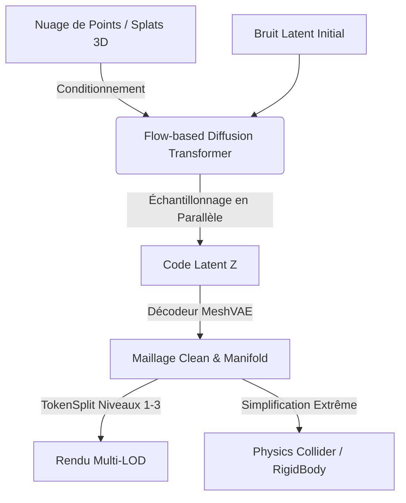

# 🔬 FoveaEngine — Analyse R&D : Intégration de MeshFlow pour LOD & Collisions Physiques

> Basé sur : `github.com/facebookresearch/meshflow` (Meta AI / CVPR 2026 Highlight)  
> Date d'analyse : 2026-06-14  
> Statut : Document de Recherche & Développement (R&D)

---

## 📋 RÉSUMÉ DE L'ANALYSE R&D

Dans le cadre du développement de **FoveaEngine**, l'un des verrous technologiques majeurs est la **génération automatique de colliders physiques (RigidBody3D / CollisionShape3D)** et de **maillages de rendu simplifiés (LOD)** à partir de reconstructions volumétriques denses ou bruitées (telles que les nuages de points issus de COLMAP ou les centres de 3D Gaussian Splats).

La méthode algorithmique traditionnelle de simplification de maillage (par exemple, Quadric Error Metrics dans [mesh_simplifier.gd](file:///f:/foveaengine/fovea-engine/addons/foveacore/scripts/mesh_simplifier.gd)) nécessite un maillage dense de départ qui est souvent difficile à reconstruire proprement (Marching Cubes bruité, non-manifold) et génère des géométries avec des trous ou des auto-intersections impropres à la simulation physique.

Le projet **MeshFlow** de Meta AI (CVPR 2026) introduit une rupture majeure dans la modélisation 3D générative. Voici comment ses idées clés s'applient à notre moteur :

| Innovation MeshFlow | Principe Technique | Impact sur FoveaEngine |
|---|---|---|
| **Continuous Latent Space (MeshVAE)** | Auto-encodeur de maillages qui apprend un espace latent continu pour les sommets et la connectivité. | Permet de décoder des formes toujours valides, étanches (manifold) et "artistiques" (clean topology), sans erreurs de quantification. |
| **Point-Cloud-Conditioned Generation** | Modèle de diffusion (Flow-based DiT) conditionné par nuage de points. | Reconstruit un maillage propre directement à partir des positions des Splats 3D ou des points d'appariement COLMAP. |
| **Parallélisme via Rectified Flow** | Génération de tous les tokens de maillage en parallèle (18× plus rapide que les modèles autorégressifs). | Génération "sub-second" (moins d'une seconde), rendant viable la génération à la volée ou lors de l'import d'assets. |
| **Hiérarchie TokenMerge/TokenSplit** | Downsampling et upsampling de tokens géométriques dans le transformer. | Extraction directe de versions multi-résolutions (LODs) d'un même asset à partir de son code latent. |

---

## 🔍 COMPRENDRE L'ARCHITECTURE DE MESHFLOW (META AI)

MeshFlow repose sur une approche en deux étapes fondamentales :



### 1. MeshVAE : L'espace latent des maillages clean
Au lieu de traiter les coordonnées de sommets comme du texte ou des entiers quantifiés (comme dans PolyGen ou MeshGPT), le **MeshVAE** utilise un espace continu :
* **Encoder & Decoder :** Des blocs Transformers à 8 couches traitant des tokens de sommets et de faces.
* **TokenMerge / TokenSplit :** Similaires aux opérations PixelShuffle en traitement d'images, ces blocs regroupent ou étendent les tokens pour modifier la résolution du graphe de maillage.
* **Résultat :** Le modèle apprend une "priorité de forme" (shape prior). Lorsqu'il reconstruit un maillage, il favorise des topologies propres (des boucles de polygones régulières, des structures fermées), éliminant d'emblée le bruit haute-fréquence inhérent aux scans 3DGS.

### 2. Le Flow-based Diffusion Transformer (DiT)
* Utilise un modèle de diffusion basé sur les flux rectifiés (Rectified Flow Matching).
* Le processus de débruitage latent s'effectue en parallèle sur toute la grille de tokens de maillage.
* **Conditionnement :** Un encodeur de forme (type Shape2VecSet) projette un nuage de points d'entrée (par exemple, 32 768 points extraits de nos Gaussian Splats) sous forme de tokens de contexte pour le transformer.

---

## 🎯 APPLICATION DIRECTE À FOVEAENGINE : LOD & COLLIDERS

### 1. La Problématique des Colliders dans FoveaEngine (RigidBody3D)
Actuellement, [physics_proxy_generator.gd](file:///f:/foveaengine/fovea-engine/addons/foveacore/scripts/advanced/physics_proxy_generator.gd) propose d'associer un objet `FoveaSplattable` à un `RigidBody3D` en utilisant un maillage basse résolution (low-poly) généré en amont par un outil externe (StudioTo3D) ou estimé par une simple AABB (boîte englobante). 

Si l'utilisateur tente de générer un collider à partir d'un scan brut :
1. Les algorithmes de reconstruction de surface classiques (ex: Poisson Reconstruction) échouent à cause des floaters (splats fantômes) et du bruit.
2. Le maillage obtenu est complexe (plus de 100k triangles), non-manifold (bords ouverts) et inutilisable par le moteur physique de Godot (GodotPhysics / Jolt).
3. Le maillage simplifié par QEM ([mesh_simplifier.gd](file:///f:/foveaengine/fovea-engine/addons/foveacore/scripts/mesh_simplifier.gd)) hérite de ces erreurs topologiques, produisant des colliders déformés ou troués.

### 2. Solution MeshFlow pour les Colliders
En utilisant le modèle de MeshFlow conditionné par nuage de points, nous pouvons implémenter un pipeline de génération de colliders robuste :
* **Filtrage des Splats :** On extrait les centres des splats ayant une opacité supérieure à un seuil $\alpha$ (ex. $\alpha > 0.15$) et une échelle cohérente pour éliminer le bruit.
* **Conditionnement de la forme :** Ces points purifiés servent de conditionnement d'entrée.
* **Génération du maillage de base :** MeshFlow génère en moins d'une seconde un maillage étanche (watertight), propre et à faible densité polygonale (ex. 500 à 1000 faces).
* **Création du Collider :** Ce maillage est importé directement en tant que `ConvexPolygonShape3D` (ou décomposé en sous-formes convexes via l'outil V-HACD de Godot). Le collider épouse parfaitement la forme physique réelle de l'objet scanné sans aucun artéfact topologique.

### 3. Solution MeshFlow pour les LODs (Level of Detail)
Les LODs sont cruciaux pour maintenir un framerate de 60+ FPS dans les grandes scènes de FoveaEngine :
* Grâce à la structure hiérarchique de **MeshVAE** (via les blocs TokenSplit), nous pouvons demander au décodeur d'arrêter la reconstruction à différents niveaux hiérarchiques.
* On obtient alors des maillages de résolution variable d'un même objet, partageant la même structure topologique globale :
  * **LOD 0 (High) :** Reconstruction complète (géométrie fine, détails visuels).
  * **LOD 1 (Medium) :** Sortie après le premier bloc TokenMerge (idéal pour moyenne distance).
  * **LOD 2 (Low / Collider) :** Sortie après le deuxième bloc TokenMerge (très basse résolution, idéal pour l'arrière-plan ou pour la simulation physique).

---

## 🛠️ ARCHITECTURE DU PIPELINE PROPOSÉ

Nous proposons d'intégrer MeshFlow via un service hybride Python (Backend d'optimisation) et GDScript/C# (Godot Editor / Runtime).

```
+-------------------------------------------------------------+
|                     Godot / FoveaEngine                     |
+------------------------------+------------------------------+
                               |
                   1. Export Splat Center Points (PLY)
                               |
                               v
+------------------------------+------------------------------+
|             Python Backend (meshflow_server.py)             |
+-------------------------------------------------------------+
|  2. Point Sampling & Floater Cleaning                       |
|  3. PyTorch Inference (MeshFlow conditioned on points)      |
|  4. Decode Multi-Resolution Latents (LOD 0, 1, 2)           |
|  5. Export GLTF / GLB Bundle                                |
+------------------------------+------------------------------+
                               |
                   6. Read GLTF Bundle & Assets
                               |
                               v
+------------------------------+------------------------------+
|                     Godot / FoveaEngine                     |
+-------------------------------------------------------------+
|  7. Create PhysicsProxy with LOD 2 Collider                 |
|  8. Instantiate LOD 0 / 1 Meshes for far-rendering          |
+-------------------------------------------------------------+
```

### 1. Extension du Serveur Python (meshflow_server.py)
Un nouveau service de traitement asynchrone fonctionnant en parallèle avec notre pipeline d'entraînement 3DGS.

```python
# FoveaEngine — meshflow_processor.py (Concept)
import torch
from meshflow.models import MeshVAE, FlowTransformer
from meshflow.utils import load_ply_points, export_glb

class FoveaMeshFlowProcessor:
    def __init__(self, checkpoint_dir):
        # Charger les modèles pré-entraînés de Meta AI
        self.vae = MeshVAE.load_from_checkpoint(f"{checkpoint_dir}/mesh_vae.ckpt").cuda()
        self.flow_dit = FlowTransformer.load_from_checkpoint(f"{checkpoint_dir}/flow_dit.ckpt").cuda()

    def process_splats_to_mesh(self, ply_path, output_glb_path):
        # 1. Charger et filtrer les points du PLY (Splats 3D)
        points = load_ply_points(ply_path, min_opacity=0.15, max_scale=0.05)
        
        # 2. Échantillonner à N points requis par l'encodeur (ex. 32768)
        sampled_points = self.sample_points(points, target_count=32768)
        
        # 3. Lancer la génération du maillage latent en parallèle (Rectified Flow)
        latent_code = self.flow_dit.generate(sampled_points, steps=25)
        
        # 4. Décoder à différents niveaux de résolution (LOD 0, LOD 1, LOD 2)
        lod_0_mesh = self.vae.decode(latent_code, target_resolution="high")
        lod_1_mesh = self.vae.decode(latent_code, target_resolution="medium")
        lod_2_mesh = self.vae.decode(latent_code, target_resolution="low") # Pour Physics Collider
        
        # 5. Exporter sous forme de bundle GLTF multi-LOD
        export_glb(output_glb_path, meshes=[lod_0_mesh, lod_1_mesh, lod_2_mesh])
```

### 2. Intégration Godot : `physics_proxy_generator.gd`
Nous adaptons la classe existante pour interagir avec ce pipeline génératif :

```gdscript
# Extension de physics_proxy_generator.gd
class_name AdvancedPhysicsProxyGenerator
extends Node3D

@export var meshflow_server_url := "http://localhost:8000/process"
@export var target_rigidbody_mass := 1.0

## Générer un proxy physique propre à l'aide de MeshFlow
func generate_meshflow_physics_body(splattable: FoveaSplattable) -> RigidBody3D:
	# 1. Exporter les centres des splats dans un PLY temporaire
	var temp_ply_path = "user://temp_splats_" + str(splattable.get_instance_id()) + ".ply"
	splattable.export_to_ply(temp_ply_path)
	
	# 2. Envoyer la requête d'inférence au serveur MeshFlow
	var glb_output_path = "res://reconstructions/physics_" + splattable.name + ".glb"
	var success = await _request_meshflow_generation(temp_ply_path, glb_output_path)
	
	if not success:
		push_error("MeshFlow: Échec de la génération du maillage physique.")
		return null
		
	# 3. Charger le GLB généré contenant les LODs
	var glb_scene = load(glb_output_path).instantiate()
	var lod_2_mesh_node: MeshInstance3D = glb_scene.get_node("LOD_2")
	var lod_2_mesh: ArrayMesh = lod_2_mesh_node.mesh
	
	# 4. Créer le RigidBody3D avec le maillage Low-Poly de MeshFlow
	var body = RigidBody3D.new()
	body.name = "MeshFlowPhysics_" + splattable.name
	body.mass = target_rigidbody_mass
	
	# Génération d'une forme de collision convexe (idéal pour la physique rigide)
	var shape = CollisionShape3D.new()
	var collider = ConvexPolygonShape3D.new()
	collider.points = lod_2_mesh.get_faces()
	shape.shape = collider
	body.add_child(shape)
	
	# Connecter le FoveaSplattable en tant qu'enfant visuel
	splattable.get_parent().remove_child(splattable)
	body.add_child(splattable)
	splattable.transform = Transform3D.IDENTITY
	
	print("MeshFlow R&D: Liaison physique établie avec succès pour ", splattable.name)
	return body
```

---

## 🗺️ PLAN D'ACTION R&D (FEUILLE DE ROUTE)

Pour intégrer ces concepts dans **FoveaEngine**, nous prévoyons les phases suivantes :

### Phase 1 : Prototypage et Évaluation du Pipeline (Sprint 1-2)
- [ ] Mettre en place l'environnement Python avec le dépôt `facebookresearch/meshflow`.
- [ ] Écrire un script d'export des splats de FoveaEngine vers le format Point Cloud (XYZ + Opacity).
- [ ] Tester l'inférence MeshFlow hors-ligne sur nos scènes de test (ex: le Bonsai de `train.py`).
- [ ] Évaluer la qualité des topologies de maillages obtenues par rapport à notre `MeshSimplifier` QEM actuel.

### Phase 2 : Raccordement Physique & Collisions (Sprint 3)
- [ ] Convertir les maillages bas-détails (LOD 2) de MeshFlow en fichiers `.tres` (ConvexPolygonShape3D) dans Godot.
- [ ] Mesurer les performances physiques (temps de calcul des collisions, stabilité dans GodotPhysics/Jolt).
- [ ] Mettre en place l'interface de communication HTTP/gRPC entre Godot (éditeur) et le serveur d'inférence MeshFlow.

### Phase 3 : Gestion dynamique des LODs de Rendu (Sprint 4)
- [ ] Configurer un système de bascule automatique entre le rendu Gaussian Splatting haute fidélité (proche) et les maillages simplifiés de MeshFlow (moyenne et longue distance).
- [ ] Intégrer les maillages multi-résolution dans le pipeline de streaming géographique de FoveaEngine.

---

## 💡 INSIGHTS STRATÉGIQUES POUR FOVEAENGINE

1. **Rupture par rapport aux méthodes algorithmiques traditionnelles :** Les approches géométriques pures (QEM, Marching Cubes) n'ont pas de "compréhension sémantique" de l'objet. MeshFlow possède un *prior de forme* appris sur des millions d'objets 3D de qualité professionnelle. Il sait qu'une table est plane, qu'une chaise a des pieds droits, ce qui évite les colliders "mous" ou distordus.
2. **Watertight par défaut :** Le décodeur MeshVAE tend naturellement à fermer les géométries, ce qui est une condition sine qua non pour les algorithmes de simulation de corps rigides dans les moteurs physiques modernes.
3. **Optimisation CPU/GPU :** Décharger la simplification géométrique vers un modèle de Deep Learning s'exécutant sur GPU (ou via un serveur cloud local) libère le CPU de l'utilisateur de calculs de décimation de maillage lourds en GDScript.

---
*Rapport d'analyse R&D — FoveaEngine 2026*
