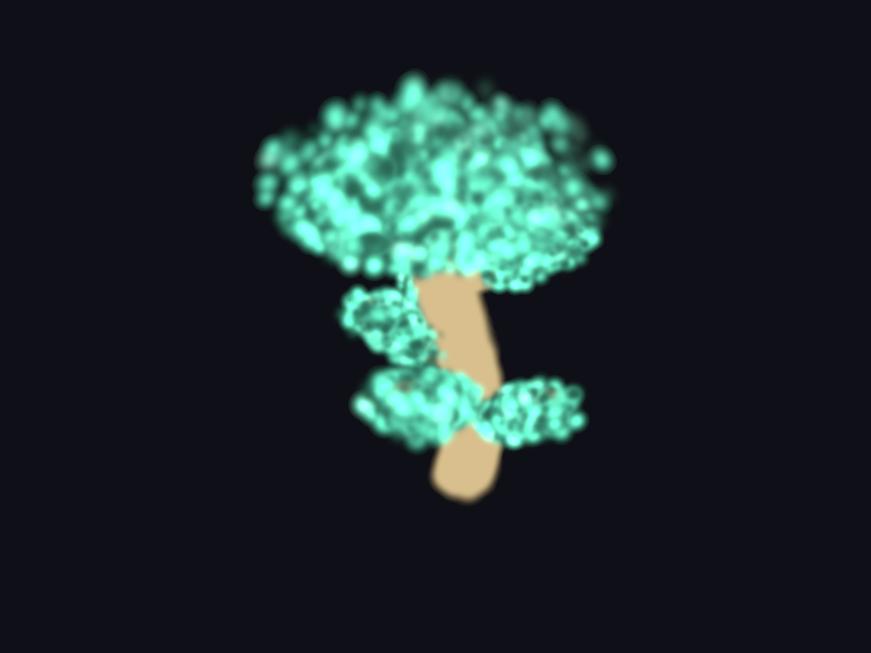

  

  <h1>FoveaEngine Autowiki</h1>
  
<strong>Repository-grounded knowledge, validation records, conflicts, and adoption gates.</strong>

  
<a href="../../README.md">Project overview</a> · <a href="../feature-status.md">Feature status</a> · <a href="tests/README.md">Validation matrix</a> · <a href="roadmap.md">Roadmap</a>

This directory is the evidence-based knowledge index for FoveaEngine. It describes the current repository, records disagreements without hiding them, and points to executable sources instead of duplicating large historical plans.

Current PLY runtime evidence: <code>demo_bonsai.ply</code> loaded through <code>FoveaSplat3D</code> in Godot 4.7.dev5, Forward+, and D3D12 desktop mode. This is a compatibility capture, not a benchmark.

## Evidence policy

| State | Meaning |
| --- | --- |
| **VALIDATED** | Reproduced in the current task with a recorded command, result, environment, and date. |
| **VALIDATED_WITH_VERSION_GAP** | Reproduced, but with a Godot version below the declared project baseline. |
| **IMPLEMENTED_UNVALIDATED** | An executable path exists, but this task did not reproduce it. |
| **EXPERIMENTAL** | Implemented but unstable, hardware-dependent, or not release-certified. |
| **PROPOSED** | Design or roadmap only. |
| **CONFLICT** | Current sources disagree and require an explicit decision or compatibility test. |
| **FAILED** | The scoped path executed, but a required gate did not pass. |
| **BLOCKED** | The required environment, dependency, or compatible contract is unavailable. |

When sources disagree, use this precedence: implementation → current reproducible result → CI → release documentation → plans and historical audits.

## Current evidence snapshot

| Surface | State | Current evidence |
| --- | --- | --- |
| Public `FoveaSplat3D` / delegate lifecycle | **VALIDATED** | Property, preset, signal, runtime-ownership, and real one-splat-load behavior passed 26/26; the 12,473-splat and 8,000-splat PLY fixtures also produced D3D12 captures. |
| `.splat` parser and router | **VALIDATED** | Godot 4.7.dev5 passed 14/14 assertions over a deterministic 256-splat round-trip and negative inputs. |
| `.spz` decoder | **PROPOSED** | Planned input is rejected and no longer appears in the public file picker until a decoder and fixtures exist. |
| `.fovea` v2 structure and packed records | **VALIDATED** | Godot 4.7.dev5 passed 28 canonical, packed-record, corrupt-input, and Rust-fixture assertions; Rust passed five tests and reproduced the 208-byte fixture exactly. |
| Native `.fovea` runtime rendering | **EXPERIMENTAL** | A deterministic CPU passthrough produced a framed green/brown 800×600 D3D12 capture from 12,473 records (11,808 after cleaning). Palette, AABB, and linear covariance handling pass their source contract; a synthetic two-instance GPU layout/readback passes, while representative native parity and acceleration remain open. |
| GPU depth sorter | **VALIDATED** | The historical incomplete-permutation failure is superseded on the recorded D3D12 Forward+ RTX 5060 Ti path: 30/30 assertions passed through 17,013 splats with a complete strict back-to-front permutation. Invalid results retain the exact CPU fallback; other hardware and APIs remain separate gates. |
| C++ GDExtension | **EXPERIMENTAL** | Rust retains the canonical descriptor and `foveacore.dll`; C++ now exports `foveacore_cpp_init` to `foveacore_cpp.dll`. The ownership contract passed 14/14, the Windows release build succeeded, and Godot instantiated `FoveaRenderer`; CI and cross-platform gates remain open. |
| Transparency visual harness | **EXPERIMENTAL** | A deterministic D3D12 framebuffer oracle measured one/two 50% red layers at 0.498/0.749 versus 0.500/0.750, exited `0` cleanly, and its forced negative control exited `1`. The five 3D layouts remain unvalidated against the production splat shader. |
| Developer API reference | **VALIDATED** | Active stable-node, autoload-facade, and reconstruction methods/signals are source-extracted by a 35-assertion non-GPU drift guard. |
| `FoveaCoreManager` facade | **VALIDATED** | Godot 4.7.dev5 passed 30/30 orchestration/control assertions and 4/4 dynamic-registration assertions in the headless desktop fallback. |
| Experimental demo scenes | **PROPOSED** | Eight named `.tscn` files contain only empty `Node3D` roots; no selector hub is present. |

## Knowledge map

| Area | Canonical page | Purpose |
| --- | --- | --- |
| Engine contract | [spec.md](spec.md) | Goals, constraints, APIs, formats, tests, risks, and acceptance criteria. |
| Architecture | [architecture.md](architecture.md) | Product boundary, components, and end-to-end flows. |
| FoveaCore | [fovea-core/README.md](fovea-core/README.md) | Splat loading, rendering, native paths, shaders, and compression. |
| Godot | [godot/README.md](godot/README.md) | Nodes, autoloads, plugins, VR, interactions, and editor behavior. |
| Pipeline | [pipeline/README.md](pipeline/README.md) | Reconstruction, build, CI, audit, logs, metrics, and interchange. |
| Agents | [agents/README.md](agents/README.md) | Proposed audit, fix, performance, and Wiki agent contracts. |
| Validation | [tests/README.md](tests/README.md) | Automated, GPU, visual, VR, and performance test surfaces. |
| Research | [research/README.md](research/README.md) | Hypotheses, baselines, experiments, and retained conclusions. |
| Decisions | [design-decisions.md](design-decisions.md) | Accepted and pending architecture decisions. |
| Priorities | [roadmap.md](roadmap.md) | Evidence-based work ordered by exit criteria. |
| Agent prompt | [PROMPT.md](PROMPT.md) | Reusable operating contract for future Autowiki tasks. |

## Update protocol

1. Inspect Git status and preserve unrelated changes.
2. Trace the affected implementation, tests, CI, and documentation.
3. Update only impacted pages and attach an evidence state to capability claims.
4. Record cross-cutting choices in `design-decisions.md` and measurable experiments in `research/`.
5. Run documentation checks plus the smallest relevant executable validation.

## Initial compilation

The initial compilation on 2026-07-16 found a working FoveaCore-oriented project structure and two high-value documentation conflicts, both now resolved:

- **RESOLVED:** `.fovea` v2 is frozen as `FOVEA_3D`, a 72-byte header, and 16-byte splat records. `plans/gaussian_compression_spec.md` is now explicitly a future v3 research proposal.
- **RESOLVED:** `docs/developer_reference.md` now distinguishes autoload names from implementation classes and matches the active stable-node, manager, session, backend, and processor signatures. A source-extracted non-GPU guard fails on API drift.

The [roadmap](roadmap.md) keeps broader generated-reference automation separate from these closed contract conflicts.
