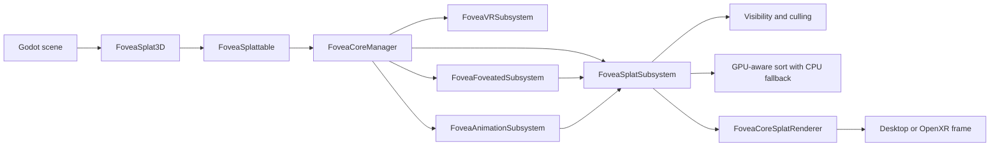
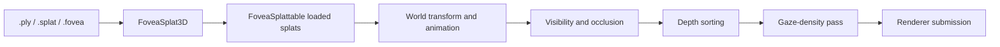
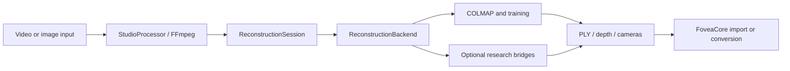

# FoveaEngine Architecture

## Product boundary

**IMPLEMENTED_UNVALIDATED:** `addons/foveacore` is the canonical product path. It contains the public Godot API, the GDScript renderer and subsystems, shaders, reconstruction tooling, tests, and a Rust native fast path.

**EXPERIMENTAL:** `addons/fovea_labs` and `addons/fovea_delta_painter` are separate enabled plugins in the development project. Their enabled development state does not make them part of the minimal release package.

**IMPLEMENTED_UNVALIDATED:** `addons/fovea_engine` and `FoveaEngine.csproj` form a parallel C# surface compiled by CI but not treated as the shipped renderer.

## Runtime components

The manager is an orchestrator and dependency owner. Rendering, VR, foveation, animation, visibility, sorting, and reconstruction logic belong to specialized components.

## Asset flow

`.fovea` is the native container. Its current implemented contract is documented in [spec.md](spec.md); historical compact-format plans are not authoritative readers.

`.spz` remains a planned decoder and is rejected rather than advertised as a supported input.

## Reconstruction flow

**EXPERIMENTAL:** StudioTo3D coordinates capture preprocessing, external reconstruction, and result import.

Each external backend must expose unavailable, dry-run, and real-execution states explicitly. Bridge scripts alone do not prove that dependencies or weights exist.

## Build and validation flow

The active CI validates GDScript parsing, Python bridge syntax, C# build/test, Godot import and script compilation, non-GPU tests, informative GPU tests, startup smoke tests, visual regression bootstrap, Rust builds/tests/lints, and a Windows C++ GDExtension build.

Current validation ownership is detailed in [tests/README.md](tests/README.md). A configured CI job is **IMPLEMENTED_UNVALIDATED** until its current run is observed.

## Dependency rules

- `FoveaSplat3D` may delegate to `FoveaSplattable`; callers should not need internal renderer classes for normal loading.
- `FoveaCoreManager` may wire subsystems but should not absorb their domain algorithms.
- Subsystems may depend on injected renderer/culler/sorter interfaces, not on unrelated editor tooling.
- Reconstruction backends must remain asynchronous and cancelable.
- Format readers and writers must share versioned fixtures.
- Wiki agents may inspect all layers but may change only the task-approved scope.
