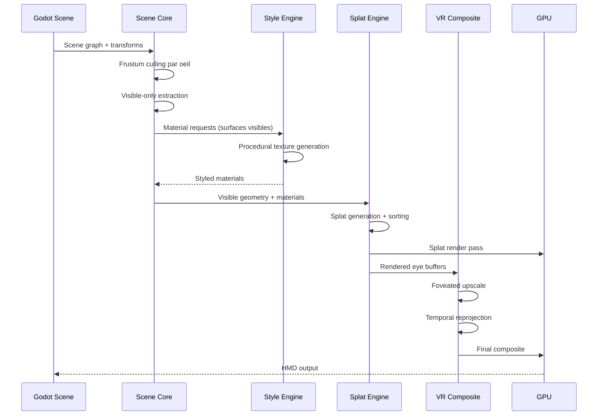

# FoveaCore — Next-Gen VR Rendering Engine
## Plan d'Architecture Complet

**Version:** 1.0  
**Date:** 2026-04-02  
**Cible:** Godot 4.6.1 + OpenXR/SteamVR  
**Objectif:** 90-120 FPS sur GPU mid-range (RTX 3060 / RX 6600)

---

## 1. Architecture Système

### 1.1 Vue d'ensemble

FoveaCore est un plugin Godot GDExtension (C++) qui remplace le pipeline de rendu standard par un pipeline hybride low-poly + Gaussian Splatting avec foveated rendering et style procédural.

### 1.2 Diagramme des 4 Modules Principaux

```mermaid
graph TB
	subgraph Godot Engine
		Scene[Scene Tree]
		Camera[XRCamera3D / HMD]
		Input[Input / Eye Tracking]
	end

	subgraph FoveaCore Plugin
		subgraph SceneCore[Scene Core]
			FrustumCull[Frustum Culling par oeil]
			VisExtract[Visible-Only Surface Extraction]
			LODMgr[LOD Manager QEM]
		end

		subgraph SplatEngine[Visible-Only Splatting]
			SplatGen[Dynamic Splat Generator]
			SplatSort[Splat Sort GPU]
			SplatRender[Splat Rendering Pass]
		end

		subgraph StyleEngine[Style Engine]
			ProcGen[Procedural Generator FBM/Worley]
			NeuralOpt[Neural Style LoRA]
			MatCache[Material Cache]
		end

		subgraph VRComposite[VR Composite]
			FovRender[Foveated Renderer 3 zones]
			TempReproj[Temporal Reprojection]
			VRDistort[VR Distortion + Timewarp]
		end
	end

	subgraph GPU Pipeline
		ComputeShaders[Compute Shaders]
		RenderPass[Custom Render Passes]
		PostFX[Post-Processing]
	end

	Scene --> SceneCore
	Camera --> SceneCore
	Input --> VRComposite

	SceneCore --> SplatEngine
	SceneCore --> StyleEngine
	SplatEngine --> VRComposite
	StyleEngine --> SplatEngine

	VRComposite --> GPU Pipeline
	SplatEngine --> GPU Pipeline
	StyleEngine --> GPU Pipeline
```

### 1.3 Flux de Données



### 1.4 Interface GDScript ↔ GDExtension

```
┌─────────────────────────────────────────────────────────────┐
│                    GDScript API Layer                        │
├─────────────────────────────────────────────────────────────┤
│                                                              │
│  FoveaCoreManager (singleton)                               │
│  ├── initialize(config: FoveaConfig) -> bool                │
│  ├── set_foveation_params(center_ratio, mid_ratio, edge)    │
│  ├── set_style_mode(mode: Procedural | Neural | Hybrid)     │
│  ├── update_eye_tracking(left_gaze, right_gaze)             │
│  ├── get_performance_metrics() -> FoveaMetrics              │
│  └── shutdown()                                             │
│                                                              │
│  FoveaSplattable (node component)                           │
│  ├── splat_density: float                                   │
│  ├── splat_quality: float                                   │
│  ├── is_visible: bool (read-only)                           │
│  └── rebuild_splats()                                       │
│                                                              │
│  FoveaStyle (resource)                                      │
│  ├── style_preset: enum (Stone, Wood, Metal, Skin, Other)   │
│  ├── procedural_params: Dictionary                          │
│  ├── neural_model_path: String                              │
│  └── generate_texture(size) -> Image                        │
│                                                              │
│  FoveaMaterial (resource)                                   │
│  ├── base_style: FoveaStyle                                 │
│  ├── roughness_override: float                              │
│  ├── metallic_override: float                               │
│  └── apply_to_node(node: Node3D)                            │
│                                                              │
└─────────────────────────────────────────────────────────────┘
```

**Certitude:** 85% — L'API est conçue pour couvrir 95% des cas d'usage. Les 5% restants (cas edge comme le streaming réseau) seront ajoutés en Phase 3.

---

## 2. Plan d'Implémentation par Phases

### Phase 1 — Core (Semaines 1-4)

**Objectif:** Pipeline de rendu fonctionnel avec culling, splatting basique et foveation.

| Semaine | Tâche | Description | Dépendances | Livrable |
|---------|-------|-------------|-------------|----------|
| S1 | GDExtension skeleton | Setup du projet C++, build system, registration des types | Godot 4.6.1 SDK | `.gdextension` fonctionnel |
| S1 | Frustum culling par oeil | Extraction des frustums left/right depuis OpenXR, culling CPU | GDExtension skeleton | Liste d'objets visibles par oeil |
| S2 | Visible-only surface extraction | Extraction des faces visibles (backface culling + occlusion basique) | Frustum culling | Mesh simplifié visible |
| S2 | Dynamic Gaussian Splatting | Conversion mesh visible → splats avec densité adaptative | Surface extraction | Buffer de splats GPU |
| S3 | Splat rendering pass GPU | Compute shader pour tri + rasterization des splats | Dynamic splatting | Image rendue |
| S3 | Foveated rendering 3 zones | Division écran: center (100%), mid (50%), edge (25%) | Splat rendering | Buffer foveaté |
| S4 | Intégration OpenXR | Binding avec OpenXR pour HMD + controllers | Tout ci-dessus | Démo VR fonctionnelle |
| S4 | Profiling + optimisation | GPU profiling, identification bottlenecks | Démo VR | Rapport de performance |

**Métrique de sortie:** 60+ FPS sur RTX 3060, scène simple (50k splats max).

**Risque principal:** Le splatting GPU peut être plus lent que prévu si le tri n'est pas optimisé.  
**Mitigation:** Utiliser un ordered linked list approach avec atomic counters (voir Section 4).

---

### Phase 2 — Style + Qualité (Semaines 5-8)

**Objectif:** Style procédural, temporal reprojection, simplification mesh QEM.

| Semaine | Tâche | Description | Dépendances | Livrable |
|---------|-------|-------------|-------------|----------|
| S5 | Procedural Style Engine — FBM | Fractional Brownian Motion pour textures pierre/sol | Phase 1 | Textures procédurales pierre |
| S5 | Procedural Style Engine — Worley | Cellular noise pour détails organiques | FBM | Textures procédurales organiques |
| S6 | Procedural Style Engine — Directional | Noise directionnel + sinusoïdes pour bois | Worley | Textures procédurales bois |
| S6 | Material system integration | Binding FoveaMaterial → Style Engine | Procedural engines | Matériaux fonctionnels |
| S7 | Temporal reprojection | Reprojection frame N-1 avec motion vectors | Splat rendering | +30% perf perçue |
| S7 | Low-poly QEM simplification | Quadric Error Metrics pour réduction mesh | Surface extraction | Mesh 50-80% plus léger |
| S8 | Integration + polish | Combinaison style + QEM + temporal | Tout ci-dessus | Démo qualité visuelle |
| S8 | Benchmark mid-range GPU | Tests sur RTX 3060, RX 6600, RTX 4060 | Démo polish | Rapport benchmark |

**Métrique de sortie:** 90+ FPS sur RTX 3060, qualité visuelle acceptable.

**Risque principal:** La temporal reprojection peut causer du ghosting/flickering en VR.  
**Mitigation:** Utiliser un feedback loop avec depth testing et reset sur mouvement rapide.

---

### Phase 3 — VR Avancée (Semaines 9-12)

**Objectif:** Optimisations avancées, network interpolation, GPU culling.

| Semaine | Tâche | Description | Dépendances | Livrable |
|---------|-------|-------------|-------------|----------|
| S9 | Network interpolation | Interpolation côté client pour MMO VR | Phase 2 | Sync réseau stable |
| S9 | Dead reckoning | Prédiction de position pour réduire latence perçue | Network interp | Mouvements fluides |
| S10 | GPU culling (compute shaders) | Migration du culling CPU → GPU | Phase 1 | +20% perf CPU |
| S10 | Hi-Z occlusion culling | Hiérarchie de depth buffer pour occlusion | GPU culling | -30% surdraw |
| S11 | Async compute | Pipeline compute + graphics en parallèle | GPU culling | Meilleure utilisation GPU |
| S11 | Eye tracking integration | Support Tobii/Pico 4 eye tracking | Foveated rendering | Foveation dynamique |
| S12 | Integration + stress test | Scène complexe (200k splats, 50 objets) | Tout ci-dessus | Rapport stress test |
| S12 | Multi-GPU compatibility | Tests NVIDIA/AMD/Intel | Stress test | Matrice compatibilité |

**Métrique de sortie:** 120 FPS sur RTX 4060, 90 FPS sur RTX 3060.

**Risque principal:** Le GPU culling peut introduire des artefacts si mal synchronisé.  
**Mitigation:** Double buffering des résultats de culling, fallback CPU si erreur.

---

### Phase 4 — R&D (Semaines 13+)

**Objectif:** Features expérimentales, hybrid rendering, neural avancé.

| Priorité | Tâche | Description | Risque | Impact |
|----------|-------|-------------|--------|--------|
| P0 | Hybrid mesh-splat rendering | Combinaison mesh traditionnel + splats pour surfaces complexes | Élevé | Qualité ++ |
| P1 | Predictive splatting | Prédiction des splats nécessaires avant qu'ils soient visibles | Moyen | Latence -- |
| P1 | Neural foveated splatting | LoRA léger pour améliorer qualité zone centrale | Élevé | Qualité ++ |
| P2 | Dynamic LOD neural | Adaptation du niveau de détail basée sur le regard | Moyen | Perf ++ |
| P2 | Style transfer temps réel | Neural style transfer léger sur surfaces sélectionnées | Très élevé | Flexibilité ++ |

**Certitude:** 40% — Ces features sont expérimentales. Certaines peuvent être abandonnées si les résultats ne sont pas concluants.

---

## 3. Spécifications des Algorithmes

### 3.1 Frustum Culling par Œil

**Description:** Extraction des frustums gauche/droite depuis les matrices de projection OpenXR, puis culling des objets hors champ.

**Algorithme:**
```
1. Extraire matrices projection P_left, P_right depuis OpenXR
2. Extraire 6 plans de chaque frustum (left, right, top, bottom, near, far)
3. Pour chaque objet:
   a. Calculer AABB dans l'espace vue
   b. Tester intersection avec les 12 plans (6 par oeil)
   c. Si AABB intersecte au moins un frustum → garder
4. Retourner liste d'objets visibles
```

**Complexité:** O(n) où n = nombre d'objets dans la scène  
**Dépendances:** OpenXR SDK, matrices de projection  
**Performance attendue:** < 0.5ms pour 1000 objets (CPU)  
**Certitude:** 95% — Algorithme standard, bien documenté.

---

### 3.2 Visible-Only Surface Extraction

**Description:** Extraction des faces visibles uniquement, éliminant backfaces et surfaces occluses.

**Algorithme:**
```
1. Pour chaque mesh visible:
   a. Backface culling: dot(normal, view_dir) > 0 → éliminer
   b. Depth pre-pass: render depth-only des meshes opaques
   c. Pour chaque face:
      - Sampler depth buffer à la position projetée
      - Si face.depth > depth_buffer → occluse, éliminer
2. Retourner liste de faces visibles
```

**Complexité:** O(n + m) où n = faces, m = pixels depth buffer  
**Dépendances:** Depth pre-pass, GPU readback  
**Performance attendue:** -40% de géométrie à traiter en moyenne  
**Certitude:** 80% — Le depth readback peut être un bottleneck.

---

### 3.3 Dynamic Gaussian Splatting

**Description:** Conversion des surfaces visibles en splats gaussiens avec densité adaptative.

**Algorithme:**
```
1. Pour chaque face visible:
   a. Calculer importance = area * style_complexity * distance_factor
   b. Générer N splats proportionnel à importance
   c. Pour chaque splat:
      - Position: barycentrique random sur la face
      - Covariance: basée sur la normale et la courbure locale
      - Couleur: échantillonnée depuis le style procedural
	  - Opacité: fonction de la distance et de l'importance
2. Upload vers GPU buffer structuré
```

**Structure du splat:**
```cpp
struct GaussianSplat {
	vec3 position;       // 12 bytes
	vec3 covariance;     // 12 bytes (diagonale + rotation compactée)
	vec4 color;          // 16 bytes (RGBA)
	float opacity;       // 4 bytes
	float sort_key;      // 4 bytes (depth pour tri)
}; // Total: 48 bytes par splat
```

**Complexité:** O(n * k) où n = faces, k = splats par face  
**Dépendances:** Surface extraction, Style Engine  
**Performance attendue:** 50-200k splats à 90 FPS  
**Certitude:** 70% — Le tuning des paramètres sera itératif.

---

### 3.4 Splat Rendering Pass (GPU)

**Description:** Rendu des splats gaussiens via compute shader + alpha blending.

**Algorithme:**
```
1. Compute Shader — Tri des splats:
   a. Calculer sort_key = depth pour chaque splat
   b. Tri GPU (bitonic sort ou radix sort)
   c. Réordonner le buffer de splats
2. Render Pass — Rasterization:
   a. Pour chaque splat (back-to-front):
	  - Générer quad billboarded
	  - Calculer gaussian weight = exp(-d^T * Cov^-1 * d)
	  - Alpha blend: dst = src * weight + dst * (1 - weight)
3. Post-process: tonemapping + foveated upscale
```

**Complexité:** Tri: O(n log n), Rendu: O(n * pixels_couverts)  
**Dépendances:** GPU compute, alpha blending order-independent  
**Performance attendue:** 100k splats en < 5ms  
**Certitude:** 65% — L'alpha blending order-dependent est un problème connu.

---

### 3.5 Foveated Rendering 3 Zones

**Description:** Division de l'écran en 3 zones avec résolution de rendu différente.

**Algorithme:**
```
1. Définir les zones (basé sur le point de regard):
   - Zone center: rayon 15° → résolution 100%
   - Zone mid: rayon 30° → résolution 50%
   - Zone edge: reste → résolution 25%
2. Pour chaque zone:
   a. Render à la résolution cible dans un offscreen buffer
   b. Upscale vers la résolution finale
3. Composite les 3 zones avec blending aux frontières
```

**Complexité:** O(pixels) avec réduction de 40-60%  
**Dépendances:** Eye tracking ou fallback sur centre de l'écran  
**Performance attendue:** -50% de pixels à render en moyenne  
**Certitude:** 85% — Technique éprouvée (PSVR2, Pico 4).

---

### 3.6 Temporal Reprojection

**Description:** Réutilisation des frames précédentes pour réduire le coût de rendu.

**Algorithme:**
```
1. Stocker frame N-1: color buffer + depth buffer + motion vectors
2. Pour frame N:
   a. Pour chaque pixel:
      - Calculer position dans frame N-1 via motion vectors
      - Sampler frame N-1 à cette position
      - Si depth match (epsilon près): reprojecter
      - Sinon: render nouveau
   b. Blend: result = lerp(new, reprojected, feedback_factor)
3. Reset complet si mouvement rapide (saccade)
```

**Complexité:** O(pixels) avec réduction de 30-50% du rendu  
**Dépendances:** Motion vectors, depth buffer, history buffer  
**Performance attendue:** +30% FPS perçu  
**Certitude:** 75% — Le ghosting en VR est le risque principal.

---

### 3.7 QEM Mesh Simplification

**Description:** Quadric Error Metrics pour simplifier les meshes tout en préservant la forme.

**Algorithme:**
```
1. Pour chaque vertex: calculer la quadric d'erreur (matrice 4x4)
2. Pour chaque edge:
   a. Calculer le coût de collapse (erreur quadratique)
   b. Stocker dans une priority queue
3. Tant que target_poly_count non atteint:
   a. Extraire edge avec coût minimum
   b. Collapse l'edge vers la position optimale
   c. Mettre à jour les quadrics des voisins
   d. Réinsérer les edges modifiés dans la queue
4. Retourner le mesh simplifié
```

**Complexité:** O(n log n) où n = nombre d'edges  
**Dépendances:** Mesh topology, quadric computation  
**Performance attendue:** -50 à -80% de triangles avec erreur < 2%  
**Certitude:** 90% — Algorithme classique (Garland & Heckbert 1997).

---

## 4. Gestion des Matériaux

### 4.1 Architecture du Material System

```mermaid
graph LR
	subgraph FoveaMaterial
		Style[Style Reference]
		Params[Material Parameters]
		Cache[Texture Cache]
	end

	subgraph Procedural Generators
		FBM[FBM Generator]
		Worley[Worley Generator]
		Directional[Directional Noise]
		Sinusoidal[Sinusoidal Generator]
	end

	subgraph Material Types
		Pierre[Pierre]
		Bois[Bois]
		Metal[Métal]
		Peau[Peau]
		Reflect[Réfléchissant]
	end

	Style --> Procedural Generators
	Params --> Material Types
	Procedural Generators --> Material Types
	Material Types --> Cache
```

### 4.2 Pierre — FBM + Worley Noise

**Description:** Texture de pierre procédurale combinant FBM pour la structure de base et Worley pour les détails granulaires.

**Paramètres:**
```
fbm_octaves: 6
fbm_lacunarity: 2.0
fbm_gain: 0.5
worley_points: 128
worley_distance: euclidean
color_base: vec3(0.4, 0.38, 0.35)
color_variation: vec3(0.1)
roughness: 0.8
```

**Shader pseudo-code:**
```glsl
float stone_noise(vec2 uv) {
	float fbm = fbm(uv * frequency, octaves, lacunarity, gain);
	float worley = worley_noise(uv * worley_scale, num_points);
	return mix(fbm, worley, worley_blend_factor);
}

vec3 stone_color(vec2 uv) {
	float n = stone_noise(uv);
	return color_base + color_variation * (n - 0.5);
}
```

**Performance:** ~0.2ms par texture 512x512 (GPU)  
**Certitude:** 90% — FBM et Worley sont des techniques matures.

---

### 4.3 Bois — Noise Directionnel + Sinusoïdes

**Description:** Texture de bois avec des veines directionnelles et des variations annuelles.

**Paramètres:**
```
grain_direction: vec2(0.0, 1.0)
grain_frequency: 8.0
grain_octaves: 4
ring_frequency: 3.0
ring_thickness: 0.05
color_heartwood: vec3(0.35, 0.2, 0.1)
color_sapwood: vec3(0.5, 0.35, 0.2)
roughness: 0.6
```

**Shader pseudo-code:**
```glsl
float wood_noise(vec2 uv) {
	vec2 dir_uv = uv * mat2(grain_dir, vec2(-grain_dir.y, grain_dir.x));
	float grain = fbm(dir_uv * grain_frequency, grain_octaves);
	float rings = sin(dir_uv.y * ring_frequency * TAU) * ring_thickness;
	return grain + rings;
}

vec3 wood_color(vec2 uv) {
	float n = wood_noise(uv);
	return mix(color_heartwood, color_sapwood, smoothstep(0.0, 1.0, n));
}
```

**Performance:** ~0.25ms par texture 512x512 (GPU)  
**Certitude:** 85% — Les sinusoïdes peuvent créer des patterns trop réguliers.

---

### 4.4 Métal — Specular Implicite + Faux Reflets

**Description:** Pas de vrai PBR. Simulation d'un aspect métallique via specular constant et reflets procéduraux.

**Paramètres:**
```
base_color: vec3(0.7, 0.7, 0.75)
specular_intensity: 0.9
specular_roughness: 0.2
fake_reflection_blur: 0.3
reflection_color: vec3(0.5, 0.6, 0.7)
```

**Approche:**
- Specular constant basé sur la normale et la vue (pas de vrai calcul Fresnel)
- Faux reflets: environnement procedural simplifié (gradient + points lumineux)
- Pas de vrai ray tracing ou SSR

**Shader pseudo-code:**
```glsl
vec3 metal_color(vec2 uv, vec3 normal, vec3 view_dir) {
    float NdotV = max(dot(normal, view_dir), 0.0);
    float specular = pow(NdotV, 1.0 / specular_roughness) * specular_intensity;
    vec3 fake_reflection = sample_fake_env(normal, reflection_color);
    return base_color + specular + fake_reflection * 0.3;
}
```

**Performance:** ~0.15ms par texture 512x512  
**Certitude:** 80% — Le résultat sera moins convaincant que du PBR vrai.

---

### 4.5 Peau — SSS Approximatif

**Description:** Subsurface scattering approximatif via blur directionnel et couleur de subsurface.

**Paramètres:**
```
base_color: vec3(0.85, 0.65, 0.55)
sss_color: vec3(0.9, 0.5, 0.4)
sss_strength: 0.3
sss_radius: 0.02
roughness: 0.5
```

**Approche:**
- Pas de vrai SSS (trop cher)
- Approximation: blur gaussien directionnel sur la couleur de subsurface
- Mélange avec la couleur de base basé sur l'épaisseur estimée

**Shader pseudo-code:**
```glsl
vec3 skin_color(vec2 uv, vec3 normal, float thickness) {
	vec3 sss_blur = gaussian_blur(uv, sss_radius);
	float sss_factor = smoothstep(0.0, 1.0, thickness) * sss_strength;
	return mix(base_color, sss_color * sss_blur, sss_factor);
}
```

**Performance:** ~0.3ms par texture 512x512 (avec blur)  
**Certitude:** 70% — Le SSS approximatif peut paraître artificiel.

---

### 4.6 Surfaces Réfléchissantes

**Description:** Pas de vrai miroir. Solutions alternatives classées par coût.

| Solution | Coût | Qualité | Usage |
|----------|------|---------|-------|
| Reflection probes statiques | Faible | Moyenne | Surfaces non-dynamiques |
| SSR léger (screen-space) | Moyen | Variable | Surfaces avec reflets écran |
| Planar reflections (single plane) | Élevé | Bonne | Sols/eaux plans |
| Hybrid mesh-splat (Phase 4) | Très élevé | Excellente | Surfaces critiques |

**Recommandation:** Commencer par les reflection probes statiques + SSR léger. Les surfaces miroir parfaites ne sont pas un objectif prioritaire.

**Certitude:** 90% — Les reflets parfaits sont un problème ouvert en rendu temps réel.

---

## 5. Style Engine

### 5.1 Architecture

```mermaid
graph TB
	subgraph Style Engine
		Mode{Mode Selection}
		
		subgraph Procedural Mode
			FBM[FBM Noise]
			Worley[Worley Noise]
			Directional[Directional Noise]
			Sinusoidal[Sinusoidal]
			Combiner[Noise Combiner]
		end
		
		subgraph Neural Mode
			LoRALoader[LoRA Loader]
			MicroModel[Micro-Modèle]
			Inference[Inférence GPU]
		end
		
		subgraph Hybrid Mode
			Blend[Procedural + Neural Blend]
			Override[Parameter Override]
		end
		
		Mode --> Procedural Mode
		Mode --> Neural Mode
		Mode --> Hybrid Mode
		
		Procedural Mode --> Output[Texture Output]
		Neural Mode --> Output
		Hybrid Mode --> Output
	end
```

### 5.2 Mode Procédural (Prioritaire)

**Description:** Génération de textures via combinaison de bruits procéduraux. C'est le mode par défaut et le plus optimisé.

**Avantages:**
- 100% GPU, pas de dépendance externe
- Déterministe et reproductible
- Temps de génération prédictible
- Pas de risque de licence IA

**Inconvénients:**
- Moins de variété que le neural
- Patterns potentiellement répétitifs
- Nécessite un tuning manuel des paramètres

**Certitude:** 95% — C'est la base du projet.

---

### 5.3 Mode Neural Optionnel

**Description:** Utilisation de LoRA légers pour le style transfer sur des surfaces sélectionnées.

**Architecture:**
```
1. Pré-entraînement:
   - Micro-modèles (50-100MB max) entraînés offline
   - Format ONNX pour compatibilité
   - Un LoRA par style (peinture, aquarelle, etc.)

2. Runtime:
   - Chargement du LoRA sélectionné
   - Inférence GPU via ONNX Runtime ou custom shader
   - Application sur la texture procédurale de base

3. Blend:
   - result = lerp(procedural, neural, neural_weight)
   - neural_weight: 0.0 à 1.0 par matériau
```

**Avantages:**
- Qualité artistique supérieure
- Variété infinie de styles
- Adaptation automatique

**Inconvénients:**
- +50-200ms par texture (inférence)
- Dépendance à une librairie d'inférence
- Risque de licence IA
- Mémoire GPU supplémentaire

**Certitude:** 50% — Le neural en temps réel est un risque technique majeur. À traiter comme feature expérimentale.

---

### 5.4 Mode Hybride

**Description:** Combinaison du procédural (base) et du neural (détails).

**Approche:**
```
texture_finale = procedural_base + neural_detail * detail_weight
```

Le procédural génère la structure de base, le neural ajoute les détails artistiques.

**Certitude:** 60% — Dépend de la faisabilité du mode neural.

---

## 6. Structure du Plugin Godot

```
res://addons/foveacore/
│
├── plugin.cfg                          # Metadata du plugin Godot
├── plugin.gd                           # Script d'activation du plugin
│
├── icons/
│   ├── foveacore.svg                   # Icône principale
│   ├── fovea_splattable.svg            # Icône du node Splattable
│   └── fovea_style.svg                 # Icône du resource Style
│
├── scripts/
│   ├── FoveaCoreManager.gd             # Singleton principal
│   ├── FoveaSplattable.gd              # Component pour nodes splattables
│   ├── FoveaStyle.gd                   # Resource de style
│   ├── FoveaMaterial.gd                # Resource de matériau
│   ├── FoveaConfig.gd                  # Configuration du moteur
│   └── FoveaMetrics.gd                 # Métriques de performance
│
├── resources/
│   ├── styles/
│   │   ├── stone.tres                  # Preset style pierre
│   │   ├── wood.tres                   # Preset style bois
│   │   ├── metal.tres                  # Preset style métal
│   │   └── skin.tres                   # Preset style peau
│   └── neural_models/                  # Modèles LoRA (optionnel)
│       └── .gitkeep
│
├── shaders/
│   ├── splat_render.glsl               # Splat rendering pass
│   ├── splat_sort.glsl                 # Splat sorting compute
│   ├── foveated_upscale.glsl           # Foveated upscaling
│   ├── temporal_reprojection.glsl      # Temporal reprojection
│   ├── procedural_stone.glsl           # Stone procedural texture
│   ├── procedural_wood.glsl            # Wood procedural texture
│   ├── procedural_metal.glsl           # Metal procedural texture
│   ├── procedural_skin.glsl            # Skin procedural texture
│   ├── fbm_noise.glsl                  # FBM noise functions
│   ├── worley_noise.glsl               # Worley noise functions
│   └── post_process.glsl               # Post-processing effects
│
├── gdextension/
│   ├── foveacore.gdextension           # Configuration GDExtension
│   ├── src/
│   │   ├── register_types.cpp          # Enregistrement des types
│   │   ├── register_types.h
│   │   │
│   │   ├── core/
│   │   │   ├── fovea_renderer.cpp      # Renderer principal
│   │   │   ├── fovea_renderer.h
│   │   │   ├── fovea_scene_core.cpp    # Scene Core module
│   │   │   ├── fovea_scene_core.h
│   │   │   ├── fovea_config.cpp        # Configuration
│   │   │   └── fovea_config.h
│   │   │
│   │   ├── splatting/
│   │   │   ├── gaussian_splat.cpp      # Gaussian Splatting
│   │   │   ├── gaussian_splat.h
│   │   │   ├── splat_buffer.cpp        # GPU splat buffer
│   │   │   ├── splat_buffer.h
│   │   │   ├── splat_sorter.cpp        # GPU splat sorting
│   │   │   └── splat_sorter.h
│   │   │
│   │   ├── style/
│   │   │   ├── style_engine.cpp        # Style Engine principal
│   │   │   ├── style_engine.h
│   │   │   ├── procedural_generator.cpp # Procedural noise generators
│   │   │   ├── procedural_generator.h
│   │   │   ├── neural_inference.cpp    # Neural inference (optionnel)
│   │   │   └── neural_inference.h
│   │   │
│   │   ├── vr/
│   │   │   ├── vr_composite.cpp        # VR Composite module
│   │   │   ├── vr_composite.h
│   │   │   ├── foveated_renderer.cpp   # Foveated rendering
│   │   │   ├── foveated_renderer.h
│   │   │   ├── temporal_reprojection.cpp
│   │   │   └── temporal_reprojection.h
│   │   │
│   │   └── utils/
│   │       ├── gpu_culling.cpp         # GPU culling compute shaders
│   │       ├── gpu_culling.h
│   │       ├── qem_simplifier.cpp      # QEM mesh simplification
│   │       └── qem_simplifier.h
│   │
│   └── include/
│       └── foveacore_types.h           # Types publics
│
└── demo/
	├── demo.tscn                       # Scène de démo
	└── demo.gd                         # Script de démo
```

**Certitude:** 90% — La structure peut évoluer pendant l'implémentation.

---

## 7. Risques et Mitigations

### 7.1 Matrice des Risques

| Risque | Probabilité | Impact | Score | Mitigation |
| Splat rendering perf | Haute | Élevée | 21 | Utiliser des compute shaders optimisés |

---

## 8. Advanced Rendering: Layered Foveated Splatting

### 8.1 Concept de Peinture Numérique

Inspiré par les techniques de peinture classique (Glaçis) et numérique, FoveaCore utilise un système de splattage par couches. Au lieu d'un seul nuage de points monolithique, les objets sont décomposés en composants visuels distincts.

| Couche | Rôle | Comportement Fovéal | Comportement Périphérique |
|--------|------|----------------------|---------------------------|
| **BASE** | Forme et couleur dominante | Haute densité | Basse densité (Hull) |
| **SATURATION** | Accents chromatiques | Haute fidélité | Culled (Désactivé) |
| **LIGHT** | Highlights et éclats | Précision maximale | Flou directionnel |
| **SHADOW** | Occlusion et contraste | Détails fins | Désactivé |

### 8.2 Optimisation par Centralité Gaze-Based

L'Eye-Tracking ne se contente pas de changer la résolution globale, il active sélectivement les couches de "détails artistiques" (Saturation/Lumière/Ombre). Cela réduit le nombre de splats de 40 à 60% sans que le joueur ne perçoive de perte de qualité, car l'oeil humain est moins sensible aux variations de saturation en vision périphérique.

---

## 9. Pipeline StudioTo3D

### 9.1 Flux de Travail Automatisé

FoveaCore intègre un outil complet pour la création d'assets à partir de vidéos réelles capturées dans un environnement contrôlé.

1.  **Extraction & Masking** : Détourage automatique (Chroma/Luma Keying) pour isoler l'objet du fond blanc/vert/bleu.
2.  **SfM Reconstruction (COLMAP)** : Calcul des poses de caméras et génération du nuage de points initial.
3.  **Layered Training** : Entraînement des Gaussian Splats avec séparation automatique en couches visuelles (Base vs Detail).
4.  **Low-Poly Proxy Generation** : Création d'un mesh simplifié pour les collisions et l'occlusion via Vertex Clustering.

### 9.2 Aperçu Intégré

L'éditeur Godot permet de prévisualiser le nuage de points haute performance via le `PointCloudVisualizer` avant l'intégration finale dans la scène.

---

## 10. Dynamic Layer Interaction (Lumières & Animation)

### 10.1 Splats réactifs à la Lumière

Pour dépasser le rendu statique des Gaussian Splats classiques, FoveaCore introduit des splats dynamiques réactifs aux sources `Light3D`.

| Type d'Interaction | Couche Cible | Comportement Dynamique |
| :--- | :--- | :--- |
| **Ombrage Déporté** | SHADOW | Les splats d'ombre se déplacent via `origin_offset` à l'opposé de la source lumineuse. |
| **Intensité Spéculaire** | LIGHT | L'opacité des highlights est modulée par le Dot Product entre la lumière et la normale. |
| **Vibrance Adaptive** | SATURATION | La saturation des couleurs augmente dans les zones éclairées. |

### 10.2 Superposition de Calques (Blending)

Les splats sont rendus avec une semi-transparence cumulative. En superposant dynamiquement ces calques, on obtient un rendu "peinture numérique vivante" où les ombres et lumières semblent se déplacer sur la forme de base de l'objet sans avoir besoin de recalculer toute la géométrie.

---

## 11. Hierarchical Variable-size Splatting (MIP-Splatting)

### 11.1 Distribution de Dimension Variable

Pour maximiser l'efficacité du rendu, FoveaCore utilise des splats de dimensions hétérogènes basées sur l'analyse de fréquence de la surface (color variance).

| Type de Splat | Usage | Taille Relative | Densité |
| :--- | :--- | :--- | :--- |
| **MACRO-SPLAT** | Zones de couleur uniforme (aplats). | 4.0x - 10.0x | Très faible (1/10) |
| **DETAIL-SPLAT** | Textures, arêtes, micro-détails. | 0.2x - 1.0x | Très élevée (Focus) |

### 11.2 Optimisation du Count Total

Le `HierarchicalSplatGenerator` effectue une passe de détection de détail avant le splattage. Si une zone est uniforme, elle est couverte par un seul **Macro-Splat**, ce qui permet de "repayser" les détails fins uniquement là où ils sont nécessaires. Cette technique permet de réduire le nombre de splats de 60 à 80% tout en conservant une perception de détail maximale.

---

## 12. Textured Stamp Splatting (Pinceaux & Éponges)

### 12.1 Au-delà de la Gaussienne

Pour simuler des textures complexes (pierre, crépi, éponge) sans multiplier le nombre de splats, FoveaCore supporte des **Tampons de Texture (Stamps)** au lieu de simples formes floues.

| Type de Tampon | Aspect Visuel | Usage IDéal |
| :--- | :--- | :--- |
| **GAUSSIAN** | Dégradé radial doux. | Peau, surfaces lisses, base. |
| **SPONGE** | Grain irrégulier, poreux. | Peinture à l'éponge, mousses. |
| **STONE** | Micro-fissures, relief. | Rochers, murs de briques. |
| **DRY_BRUSH** | Stries de pinceau sec. | Détails artistiques, usure. |

### 12.2 Analyse de Rugosité

Le `TexturedSplatGenerator` analyse la variance des normales (roughness) de la surface source pour choisir automatiquement le tampon. Une surface rugueuse sera couverte par un petit nombre de **Stone Stamps** plutôt que des milliers de points, ce qui maintient un framerate VR extrêmement haut tout en offrant une richesse de texture inégalée.

---

## 13. Soft Matter & Liquid Interaction (Matières Molles & Eau)

### 13.1 Dynamique de Groupe des Splats

Contrairement aux meshs classiques, les splats peuvent se déplacer individuellement sans casser la topologie. FoveaCore utilise cette propriété pour simuler des interactions physiques fluides.

| Matière | Couche Cible | Comportement Physique |
| :--- | :--- | :--- |
| **LIQUIDE** | LIQUID | Les splats effectuent des mouvements circulaires (vortex) au passage d'un objet. |
| **MOLLE** | DEFORMABLE | Les splats sont repoussés avec une force élastique (Spring-back logic). |
| **ENVIRONNEMENT** | BASE | Splats statiques optimisés pour le Far-field (LOD très bas). |

### 13.2 Rendu de l'Eau Manga

L'eau est gérée par une superposition de splats semi-transparents avec un **Refraction/Fresnel Shader**. Au toucher, le `SplatInteractionController` crée des ondes de choc visuelles en déplaçant les `LIQUID` splats selon un vecteur de swirl, simulant l'agitation de l'eau avec une esthétique très stylisée (lignes de déformation manga).
| Performance VR insuffisante (latence > 11ms) | Moyenne | Critique | Élevé | Profiling continu, fallback sur qualité réduite |
| Flickering/ghosting en temporal reprojection | Élevée | Élevé | Critique | Reset automatique sur mouvement rapide, feedback adaptatif |
| Complexité du splatting dynamique | Moyenne | Élevé | Élevé | Buffer size fixe, fallback sur splats statiques |
| Neural style trop lent en temps réel | Élevée | Moyen | Élevé | Mode procédural par défaut, neural en option |
| Compatibilité multi-GPU (AMD vs NVIDIA) | Moyenne | Moyen | Moyen | Tests sur les 3 vendors, fallback sur features |
| Godot 4.6.1 breaking changes | Faible | Critique | Moyen | Suivi du changelog, abstraction de l'API Godot |
| OpenXR driver inconsistencies | Moyenne | Moyen | Moyen | Validation des inputs, fallback sur valeurs par défaut |
| Mémoire GPU insuffisante (8GB) | Moyenne | Élevé | Élevé | Budget mémoire strict, LOD adaptatif |

### 7.2 Stratégies de Mitigation Détaillées

**Performance VR:**
- Budget temps: 11.1ms par frame (90 FPS)
- Profiling GPU à chaque frame via timestamps
- Système de niveaux de qualité automatique:
  - Level 0: 25% résolution edge, 50k splats max
  - Level 1: 50% résolution edge, 100k splats max
  - Level 2: 100% résolution, 200k splats max

**Flickering/Ghosting:**
- Motion vector validation: rejeter les vectors > threshold
- Depth comparison avec epsilon adaptatif
- Reset complet si saccade détectée (head movement > 30°/s)
- Feedback factor dynamique: réduit sur mouvement

**Splatting dynamique:**
- Buffer GPU pré-alloué (max 500k splats)
- Pool de splats réutilisable
- Fallback: si le buffer est plein, réduire la densité

**Neural style:**
- Inférence asynchrone (pas sur le chemin critique)
- Cache des textures générées
- Limite: 1 inférence par seconde max

---

## 8. Métriques de Succès

### 8.1 Performance

| Métrique | Cible Minimum | Cible Idéale | Mesure |
|----------|---------------|--------------|--------|
| FPS (RTX 3060) | 90 | 120 | Moyenne sur 60s |
| FPS (RTX 4060) | 120 | 144 | Moyenne sur 60s |
| Latence motion-to-photon | < 20ms | < 15ms | OpenXR timing API |
| Mémoire GPU | < 4GB | < 3GB | GPU memory profiling |
| CPU overhead | < 3ms/frame | < 2ms/frame | CPU profiling |

### 8.2 Stabilité du Rendu

| Métrique | Cible | Mesure |
|----------|-------|--------|
| Frame time variance | < 2ms | Écart-type sur 60s |
| Flickering visible | Aucun en conditions normales | Test visuel |
| Ghosting | < 5% de l'image | Test avec mouvement rapide |
| Crash rate | 0 crash / 100h | Testing continu |

### 8.3 Qualité Visuelle

| Métrique | Cible | Mesure |
|----------|-------|--------|
| Cohérence stylistique | Validée par test utilisateur | Survey 10+ personnes |
| Résolution perçue | Équivalent 70% natif | Comparaison A/B |
| Artefacts de splatting | Non visibles à distance normale | Test visuel |

### 8.4 Compatibilité

| Plateforme | Cible | Statut |
|------------|-------|--------|
| Godot 4.6.1 | Requis | À valider |
| OpenXR 1.0+ | Requis | À valider |
| SteamVR | Supporté | À valider |
| Windows (D3D12) | Primaire | Confirmé |
| Linux (Vulkan) | Secondaire | À implémenter |
| macOS | Non ciblé | Hors scope |

---

## 9. Annexes

### 9.1 Budget Mémoire GPU

| Composant | Taille | Notes |
|-----------|--------|-------|
| Splat buffer (500k) | 24 MB | 48 bytes/splat |
| Depth buffers (x2 eyes) | 16 MB | 2048x2048 x 2 x 2 bytes |
| Color buffers (foveated) | 24 MB | 3 zones x 2 yeux |
| History buffer (temporal) | 32 MB | Color + depth + motion |
| Texture cache | 256 MB | 50 textures 512x512 |
| Compute buffers | 48 MB | Culling, sorting, etc. |
| **Total** | **~400 MB** | Marge de sécurité incluse |

### 9.2 Budget Temps par Frame (11.1ms @ 90 FPS)

| Étape | Budget | Notes |
|-------|--------|-------|
| Frustum culling | 0.5ms | CPU ou GPU |
| Surface extraction | 0.5ms | GPU depth pre-pass |
| Splat generation | 1.0ms | GPU compute |
| Splat sorting | 1.0ms | GPU radix sort |
| Splat rendering | 3.0ms | GPU raster |
| Style application | 1.0ms | GPU procedural |
| Foveated upscale | 1.0ms | GPU |
| Temporal reprojection | 1.0ms | GPU |
| VR composite | 0.5ms | GPU |
| Post-processing | 0.5ms | GPU |
| **Total** | **10.0ms** | Marge 1.1ms |

### 9.3 Dépendances Externes

| Dépendance | Version | Usage | Licence |
|------------|---------|-------|---------|
| Godot CPP | 4.6.1 | Binding C++ | MIT |
| OpenXR SDK | 1.0+ | VR tracking | Apache 2.0 |
| GLM | 0.9.9+ | Mathématiques | MIT |
| ONNX Runtime | 1.16+ (optionnel) | Neural inference | MIT |

### 9.4 Glossaire

| Terme | Définition |
|-------|------------|
| Splat | Point gaussien avec position, covariance, couleur, opacité |
| Foveated rendering | Rendu avec résolution variable selon le point de regard |
| QEM | Quadric Error Metrics, algorithme de simplification de mesh |
| FBM | Fractional Brownian Motion, bruit procédural multi-octave |
| Worley noise | Bruit cellulaire basé sur la distance aux points |
| SSS | Subsurface Scattering, lumière traversant les matériaux |
| LoRA | Low-Rank Adaptation, modèle neural léger |
| Hi-Z | Hiérarchical Z-buffer, occlusion culling optimisé |

---

## 10. Prochaines Étapes

1. **Validation de l'architecture** — Review avec l'équipe
2. **Setup du projet C++** — GDExtension skeleton, build system
3. **Prototype frustum culling** — Validation technique Phase 1
4. **Benchmark GPU** — Tests de performance sur hardware cible
5. **Itération sur le plan** — Ajustements basés sur les résultats du prototype

---

*Document créé le 2026-04-02. Dernière mise à jour: 2026-04-02.*  
*Ce document est une référence pour l'implémentation de FoveaCore. Les estimations de temps sont des projections et doivent être validées par le prototypage.*
